Large scale analysis of proteolytic processing - Polycystic kidney
disease in mice
================
Miguel Cosenza - Ada Seredynska
09 February, 2022

``` r
knitr::opts_chunk$set(echo = TRUE, 
                      message = FALSE, 
                      warning = FALSE)
```

``` r
## Required packages ----
library(tidyverse)
library(mixOmics)
library(kableExtra)
library(limma)
library(naniar)
library(clusterProfiler)
library(ReactomePA)
library(org.Mm.eg.db)
library(here)
library(janitor)
library(drawProteins)
library(seqinr)
library(ggpubr)

source(here("R/helper_functions.R"))

theme_set(theme(axis.text.x = element_text(hjust = 0.5, vjust = 0, size = 6, 
                                           angle = 90),
                axis.text.y = element_text(hjust = 0.5, vjust = 0, size = 6),
                panel.background = element_blank(),
                panel.grid.major = element_line(color = "grey"),
                panel.border = element_rect(colour = "black", fill=NA, size=1.5),
                axis.title=element_text(size=8),
                legend.text = element_text(size = 7),
                legend.title = element_text(size = 8),
                legend.key.height= unit(3, 'mm'),
                legend.key.width= unit(3, 'mm'),
                legend.position="bottom"))
```

# Sample annotation

``` r
sample_annotation <- read_csv(here("data-raw/annotation.csv"))
```

<table class="table table-striped table-hover" style="font-size: 14px; margin-left: auto; margin-right: auto;">
<thead>
<tr>
<th style="text-align:left;">
channel
</th>
<th style="text-align:left;">
sample_id
</th>
<th style="text-align:left;">
condition
</th>
</tr>
</thead>
<tbody>
<tr>
<td style="text-align:left;">
126
</td>
<td style="text-align:left;">
WT1
</td>
<td style="text-align:left;">
WT
</td>
</tr>
<tr>
<td style="text-align:left;">
127N
</td>
<td style="text-align:left;">
KO1
</td>
<td style="text-align:left;">
KO
</td>
</tr>
<tr>
<td style="text-align:left;">
127C
</td>
<td style="text-align:left;">
WT2
</td>
<td style="text-align:left;">
WT
</td>
</tr>
<tr>
<td style="text-align:left;">
128N
</td>
<td style="text-align:left;">
KO2
</td>
<td style="text-align:left;">
KO
</td>
</tr>
<tr>
<td style="text-align:left;">
128C
</td>
<td style="text-align:left;">
WT3
</td>
<td style="text-align:left;">
WT
</td>
</tr>
<tr>
<td style="text-align:left;">
129N
</td>
<td style="text-align:left;">
KO3
</td>
<td style="text-align:left;">
KO
</td>
</tr>
<tr>
<td style="text-align:left;">
129C
</td>
<td style="text-align:left;">
WT4
</td>
<td style="text-align:left;">
WT
</td>
</tr>
<tr>
<td style="text-align:left;">
130N
</td>
<td style="text-align:left;">
KO4
</td>
<td style="text-align:left;">
KO
</td>
</tr>
<tr>
<td style="text-align:left;">
130C
</td>
<td style="text-align:left;">
WT5
</td>
<td style="text-align:left;">
WT
</td>
</tr>
<tr>
<td style="text-align:left;">
131N
</td>
<td style="text-align:left;">
KO5
</td>
<td style="text-align:left;">
KO
</td>
</tr>
<tr>
<td style="text-align:left;">
131C
</td>
<td style="text-align:left;">
WT6
</td>
<td style="text-align:left;">
WT
</td>
</tr>
</tbody>
</table>

# General proteomics analysis

## Initial data loading and wrangling

**Data loading**

``` r
prot_abund_mat <- read_tsv(here("data-raw/abundance_protein_MD.tsv")) %>%
                    clean_names()

prot_ident <- read_tsv(here("data-raw/protein.tsv")) %>%
                    clean_names()

pept_abund_mat <- read_tsv(here("data-raw/abundance_peptide_MD.tsv")) %>%
                    clean_names()

pept_ident <- read_tsv(here("data-raw/peptide.tsv")) %>%
                    clean_names()

fasta <- read.fasta(here("data-raw/protein.fas"), 
                    as.string = TRUE, 
                    seqtype = "AA")
```

**Wrangling and prep for visualization**

``` r
# wide abundance matrix
prot_mat <- dplyr::select(prot_abund_mat,
                          Protein = index,
                          starts_with("wt"), 
                          starts_with("ko"))

# long abundance matrix
prot_mat_long <- pivot_longer(prot_mat,
                              cols = c(starts_with("wt"),
                                       starts_with("ko")),
                              names_to = "sample_id",
                              values_to = "Abundance") %>%
                    mutate(condition = if_else(str_detect(string = sample_id, 
                                                          pattern = "ko", 
                                                          negate = FALSE), 
                                               true = "KO",
                                               false = "WT"),
                           sample_id = str_to_upper(sample_id))

# long abundance table with annotation 
quant_annot <- left_join(prot_mat_long,
                         sample_annotation)


# wide abundance matrix without NAs 
prot_matnona <- column_to_rownames(prot_mat,
                                   "Protein") %>%
                    as.matrix() %>%
                    na.omit()

# peptide level ---- 

# wide abundance matrix
pept_mat <- dplyr::select(pept_abund_mat,
                          Peptide = index,
                          starts_with("wt"), 
                          starts_with("ko"))

# long abundance matrix
pept_mat_long <- pivot_longer(pept_mat,
                              cols = c(starts_with("wt"),
                                       starts_with("ko")),
                              names_to = "sample_id",
                              values_to = "Abundance") %>%
                    mutate(condition = if_else(str_detect(string = sample_id, 
                                                          pattern = "ko", 
                                                          negate = FALSE), 
                                               true = "KO",
                                               false = "WT"),
                           sample_id = str_to_upper(sample_id))

# long abundance table with annotation 
quant_annot_pept <- left_join(pept_mat_long,
                              sample_annotation) %>%
                    dplyr::rename(index = Peptide)

# wide abundance matrix without NAs 
pept_matnona <- column_to_rownames(pept_mat,
                                   "Peptide") %>%
                    as.matrix() %>%
                    na.omit()
# wide abundance matrix without NAs, tmt-report information

pept_abund_mat_nona <- pept_abund_mat %>% 
                    filter(index %in% rownames(pept_matnona))
```

## ID coverage

Nr of proteins identified and quantified in all samples: 5225

Nr of peptides identified and quantified in all samples: 20879

## QC plots after TMT integrator pre-processing and normalization

### By TMT channel/sample

``` r
qcplot <- ggplot(quant_annot,
                 mapping = aes(x = channel, 
                               y = Abundance, 
                               fill = condition)) +
          geom_boxplot() + 
          #facet_grid(.~recurrence, scales = "free") +
          theme(axis.text.x = element_text(hjust = 0.5, vjust = 0.1, size = 10, angle = 90),
                axis.text.y = element_text(hjust = 0.5, vjust = 0.1, size = 10),
                panel.background = element_blank(),
                panel.grid.major = element_line(color = "grey"),
                panel.border = element_rect(colour = "black", fill=NA, size=1.5),
                axis.title=element_text(size=12,face="bold"))

print(qcplot)
```

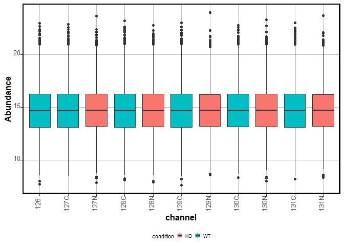<!-- -->

### By Protein

``` r
sample_proteins <- function(x, # char vector of protein IDs
                            size, # number of proteins to sample
                            seed = 363 # random seed number 
) {
  
  # select/sample N proteins to observe their abundance distribution  
  set.seed(seed)
  
  proteins <- x %>% 
    unique() %>%
    str_remove_all(pattern = "Biognosys") # get unique protein IDs
  
  which_prots <- sample(proteins, 
                        size = size, 
                        replace = FALSE)
  
}
```

``` r
which_prots <- sample_proteins(x = quant_annot$Protein,
                               size = 50,
                               seed = 156)
```

``` r
qcplot_prots <- ggplot(quant_annot %>% 
                         filter(Protein %in% which_prots),
                 mapping = aes(x = reorder(Protein,Abundance,na.rm = TRUE), 
                               y = Abundance)) +
          geom_boxplot() + 
          geom_jitter(color="black", size=0.4, alpha=0.9) +
          labs(subtitle = "Protein IDs arranged by median abudance",
               x = "Protein ID ") + 
          theme(axis.text.x = element_text(hjust = 0.5, vjust = 0.1, size = 10, angle = 90),
                axis.text.y = element_text(hjust = 0.5, vjust = 0.1, size = 10),
                panel.background = element_blank(),
                panel.grid.major = element_line(color = "grey"),
                panel.border = element_rect(colour = "black", fill=NA, size=1.5),
                axis.title=element_text(size=12,face="bold"))

print(qcplot_prots)
```

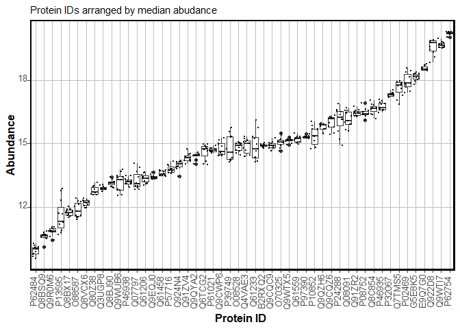<!-- -->

## Exploratory PCA

**Prepare transposed protein abundance matrix for the PCA:**

``` r
t_prot_matnona <- t(prot_matnona)
```

``` r
pca_res = pca(t_prot_matnona, 
              ncomp = 10, 
              center = TRUE, 
              scale = TRUE)
```

``` r
plot(pca_res)
```

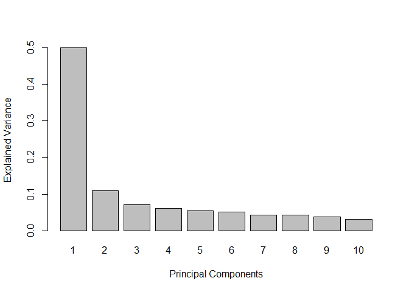<!-- -->

\~60% of the variance based on protein abundance can be explained by
components 1 and 2 after PCA.

### PCA plot on samples based on protein abundance

``` r
# preprocess pca results 
pca_variates <- pca_res$variates$X %>% 
  as.data.frame() %>%
  rownames_to_column("Sample") %>%
  mutate(condition = if_else(str_detect(Sample, "wt"),
                             true = "wt",
                             false = "ko")) 
```

``` r
ggplot(data = pca_variates,
       aes(x = PC1, y = PC2)) +
  geom_point(size = 4, aes(color = condition)) +  
  labs(title = "PCA plot of samples\nBased on the abundance values of proteins") +
  xlab(paste("PC1", round(pca_res$prop_expl_var$X[1]*100), "% var explained")) + 
  ylab(paste("PC2", round(pca_res$prop_expl_var$X[2]*100), "% var explained")) + 
  theme(axis.text.x = element_text(hjust = 0.5, vjust = 0, size = 10, angle = 360),
        axis.text.y = element_text(hjust = 0.95, vjust = 0.2, size = 10),
        panel.background = element_blank(),
        panel.grid.major = element_blank(),
        panel.border = element_rect(colour = "black", fill=NA, size=0.5),
        axis.title = element_text(size = 10),
        legend.text = element_text(size = 7),
        legend.title = element_text(size = 8),
        legend.key.height= unit(3, 'mm'),
        legend.key.width= unit(3, 'mm'),
        legend.position="bottom")
```

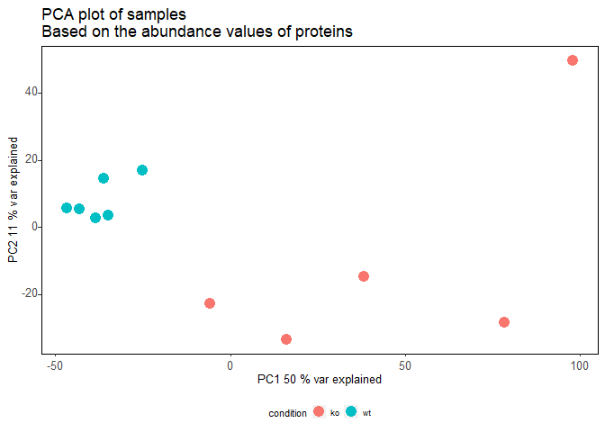<!-- -->

### Differential Expression Analysis

**Protein to Gene annotation**

``` r
prot2gene <- prot_abund_mat %>%
  dplyr::select(Protein = index, Gene = gene)
```

#### Set up design matrix

``` r
condition <- colnames(prot_matnona) %>%
                    str_sub(start = 1, 
                            end = 2) %>%
                    factor(levels = c("wt", "ko"))

design <- model.matrix(~condition)
```

Check design matrix

``` r
print(design)
```

    ##    (Intercept) conditionko
    ## 1            1           0
    ## 2            1           0
    ## 3            1           0
    ## 4            1           0
    ## 5            1           0
    ## 6            1           0
    ## 7            1           1
    ## 8            1           1
    ## 9            1           1
    ## 10           1           1
    ## 11           1           1
    ## attr(,"assign")
    ## [1] 0 1
    ## attr(,"contrasts")
    ## attr(,"contrasts")$condition
    ## [1] "contr.treatment"

#### Fit limma

``` r
fit_prot <- lmFit(prot_matnona,
                  design = design,
                  method = 'robust')

fit_eb <- eBayes(fit_prot)

limma_tab <- topTable(fit_eb, 
                      coef = 2, 
                      number = Inf) %>%
                    rownames_to_column("Protein") %>%
                    left_join(.,prot2gene)
```

#### Volcano plot

``` r
our_volcano(limma_tab, 
            FC_cutoff = 0, 
            pval_cutoff = 0.05, 
            color_diffex = "red", 
            color_nondifex = "#2a9d8f", 
            interesting_proteins = NULL, 
            vert_line_col = "red",
            hline_col = "red", 
            hline_pos = 0.05, 
            linetype = "dashed",
            increased_in = "KO", 
            comparison_title = "KO vs WT") +
  theme(axis.text.x = element_text(hjust = 0.5, vjust = 0, size = 10, angle = 360),
        axis.text.y = element_text(hjust = 0.95, vjust = 0.2, size = 10),
        panel.background = element_blank(),
        panel.grid.major = element_blank(),
        panel.border = element_rect(colour = "black", fill=NA, size=0.5),
        axis.title = element_text(size = 10),
        legend.text = element_text(size = 7),
        legend.title = element_text(size = 8),
        legend.key.height= unit(3, 'mm'),
        legend.key.width= unit(3, 'mm'),
        legend.position="bottom") 
```

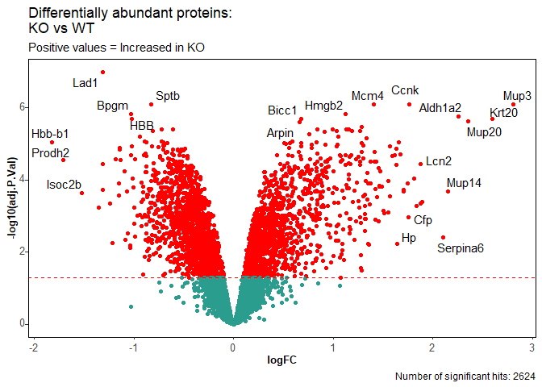<!-- -->
#### Enrichment analyses

**Prep tabular information:**

``` r
increased_in_ko <- limma_tab %>%
                    filter(logFC > 0 ,
                           adj.P.Val < 0.05) %>%
                    pull(Protein)

decreased_in_ko <- limma_tab %>%
                    filter(logFC < 0 ,
                           adj.P.Val < 0.05) %>%
                    pull(Protein)

ab_sig_prots_tryptic <- bind_rows(tibble(protein = increased_in_ko,
                                  characteristic = "up-regulated"),
                           tibble(protein = decreased_in_ko,
                                  characteristic = "down-regulated"))

unip2symb_tryptic <- bitr(ab_sig_prots_tryptic$protein, 
                  fromType = "UNIPROT", 
                  toType = c("SYMBOL", "ENTREZID"),
                  OrgDb = org.Mm.eg.db) %>%
  dplyr::rename(protein = UNIPROT) %>%
  mutate(Protein = protein)

tab_sig_prots_tryptic <- left_join(ab_sig_prots_tryptic, 
                                   unip2symb_tryptic)

unip2symbIDed_tryptic <- bitr(prot_ident$protein_id, 
                  fromType = "UNIPROT", 
                  toType = c("SYMBOL", "ENTREZID"),
                  OrgDb = org.Mm.eg.db)
```

### Reactome

``` r
group_comparison_react <- compareCluster(ENTREZID~characteristic, 
                                              data=tab_sig_prots_tryptic, 
                                              fun="enrichPathway",
                                              organism = "mouse",
                                              pvalueCutoff = 0.05,
                                              pAdjustMethod = "BH",
                                              qvalueCutoff = 0.2,
                                              universe = unip2symbIDed_tryptic$ENTREZID,
                                              minGSSize = 10,
                                              maxGSSize = 1000,
                                              readable = TRUE)
```

##### Dotplot Reactome

``` r
enrichpl <- enrichplot::dotplot(group_comparison_react, x = "characteristic") + 
          xlab("Quant in Recurrent status") +
  scale_color_continuous(low="red", 
                         high="blue",
                         guide=guide_colorbar(reverse=TRUE),
                         breaks = c(0.01, 
                                    0.04)) +
  theme(axis.text.x = element_text(hjust = 0.5, vjust = 0, size = 8, angle = 360),
        axis.text.y = element_text(hjust = 0.95, vjust = 0.2, size = 7),
        panel.background = element_blank(),
        panel.border = element_rect(colour = "black", fill=NA, size=0.5),
        axis.title.x = element_blank(),
        axis.title.y = element_blank(),
        legend.text = element_text(size = 7),
        legend.title = element_text(size = 8),
        legend.key.height= unit(3, 'mm'),
        legend.key.width= unit(3, 'mm'),
        legend.position="bottom")
```

``` r
print(enrichpl)
```

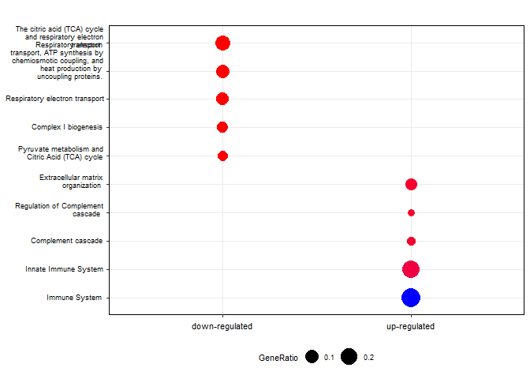<!-- -->

# Analysis of proteolytic processing

## QC plots

### By TMT channel/sample

``` r
qcplot_pept <- ggplot(quant_annot_pept,
                 mapping = aes(x = channel, 
                               y = Abundance, 
                               fill = condition)) +
          geom_boxplot() + 
          #facet_grid(.~recurrence, scales = "free") +
          theme(axis.text.x = element_text(hjust = 0.5, 
                                           vjust = 0.1, 
                                           size = 10, 
                                           angle = 90),
                axis.text.y = element_text(hjust = 0.5, 
                                           vjust = 0.1, 
                                           size = 10),
                panel.background = element_blank(),
                panel.grid.major = element_line(color = "grey"),
                panel.border = element_rect(colour = "black", 
                                            fill = NA, 
                                            size = 1.5),
                axis.title=element_text(size = 12,
                                        face = "bold"))

print(qcplot_pept)
```

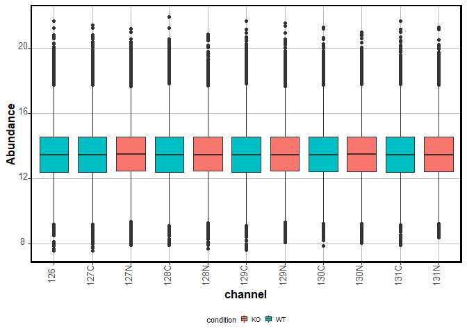<!-- -->

### By Protein

``` r
which_pept <- sample_proteins(x = quant_annot_pept$index,
                               size = 50,
                               seed = 156)
```

``` r
qcplot_pept <- ggplot(quant_annot_pept %>% 
                         filter(index %in% which_pept),
                 mapping = aes(x = reorder(index,
                                           Abundance,
                                           na.rm = TRUE), 
                               y = Abundance)) +
          geom_boxplot() + 
          geom_jitter(color="black", size=0.4, alpha=0.9) +
          labs(subtitle = "Peptide IDs arranged by median abudance",
               x = "Peptide_Protein ID") + 
          theme(axis.text.x = element_text(hjust = 1, 
                                           vjust = 0.1, 
                                           size = 4, 
                                           angle = 90),
                axis.text.y = element_text(hjust = 0.5, 
                                           vjust = 0.1, 
                                           size = 10),
                panel.background = element_blank(),
                panel.grid.major = element_line(color = "grey"),
                panel.border = element_rect(colour = "black", 
                                            fill=NA, 
                                            size=1.5),
                axis.title=element_text(size=12,
                                        face="bold"))

print(qcplot_pept)
```

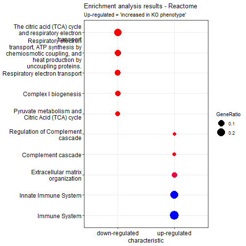<!-- -->

## Annotate peptides (specificity)

The first step for analyzing semi-specific search results in terms of
large scale analysis of proteolytic activity is to annotate the
identified peptides by their specificity.

We do that in the context of this data analysis approach with the
`annotate_peptides` function.

**Load the `annotate_peptides` function**

``` r
source(here("R/annotate_peptides.R"))
```

We need to prepare the input data frame for the `annotate_peptides`
function. Requirements: a data frame with at least 2 columns: `Genes`,
with uniprot IDs and `Peptides`, with sequences of the identified
peptides.

First, let’s check the data frame with the identified peptides.

``` r
head(pept_ident)
```

    ## # A tibble: 6 x 33
    ##   peptide      prev_aa next_aa peptide_length charges probability spectral_count
    ##   <chr>        <chr>   <chr>            <dbl> <chr>         <dbl>          <dbl>
    ## 1 AAAAAAAAAAA~ R       F                   44 5, 6          0.999              2
    ## 2 AAAAAAAAAAG~ M       G                   16 2             1.00               2
    ## 3 AAAAAAAAGAA~ A       R                   21 2             0.904              1
    ## 4 AAAAAAATKPAR F       K                   12 3             0.993              2
    ## 5 AAAAAASHLNL~ M       E                   15 2             1                  1
    ## 6 AAAAATAATKG~ M       V                   18 2, 3          1                  7
    ## # ... with 26 more variables: intensity <dbl>, assigned_modifications <chr>,
    ## #   observed_modifications <lgl>, protein <chr>, protein_id <chr>,
    ## #   entry_name <chr>, gene <chr>, protein_description <chr>,
    ## #   mapped_genes <chr>, mapped_proteins <chr>, wt1 <dbl>, ko1 <dbl>, wt2 <dbl>,
    ## #   ko2 <dbl>, wt3 <dbl>, ko3 <dbl>, wt4 <dbl>, ko4 <dbl>, wt5 <dbl>,
    ## #   ko5 <dbl>, wt6 <dbl>, mt_29 <dbl>, mt_30 <dbl>, mt_31 <dbl>, mt_32 <dbl>,
    ## #   mt_33 <dbl>

Get the two interesting columns and change the names.

``` r
pepto_annot <- dplyr::select(pept_ident,
                             Peptide = peptide, 
                             Genes = protein_id)
```

``` r
if(!file.exists(here("report/outputs/cleavage_annoated_peptides_final.tsv"))){
  cleavage_annoated_peptides <- annotate_peptides(peptide2protein = pepto_annot, 
                                                  fasta = fasta,
                                                  decoy_tag = "rev_")
  
  write_tsv(cleavage_annoated_peptides, here("report/outputs/cleavage_annoated_peptides_final.tsv"))
} else {
  cleavage_annoated_peptides <- read_tsv(here("report/outputs/cleavage_annoated_peptides_final.tsv"))
}
```

## Annotate peptides (N-term modification)

After annotating the peptides by their specificity, we want to evaluate
the chemical modifications found at the N-term. In the context of this
experimental design, we are able to use the TMT labelling at the N-term
as a corroboration of the origin of the identified peptide as a
proteolytic product.

**Load `annotate_nterm` function**

``` r
source(here("R/annotate_nterm.R"))
```

Merging table of specificity-labelled peptide with identifications
table:

``` r
cleavage_annoated_peptides <- dplyr::mutate(cleavage_annoated_peptides,
                                            Genes = protein_id) %>% 
                    dplyr::mutate(peptide = Peptide)

peptides_annotated <- left_join(pept_ident, 
                                cleavage_annoated_peptides,
                                by = c("peptide", 
                                       "protein_id"))
```

``` r
nterannot <- annotate_nterm(peptides_annotated,
                            tmtmass = 304.2072) %>%
                    clean_names()
```

## Summarize peptide counts per feature

We will use the function `summarize_peptide_counts`, which will help us
see to counts of identified peptides per interesting feature in terms of
specificity and (bio)chemical modifications.

``` r
source(here("R/summarize_peptide_counts.R"))
```

``` r
summary_count <- summarize_peptide_counts(nterannot) 
```

``` r
kbl(summary_count, booktabs = TRUE) %>%
  kable_styling(font_size = 14,
                bootstrap_options = c("striped", "hover"))
```

<table class="table table-striped table-hover" style="font-size: 14px; margin-left: auto; margin-right: auto;">
<thead>
<tr>
<th style="text-align:left;">
feature_type
</th>
<th style="text-align:right;">
n
</th>
<th style="text-align:left;">
category
</th>
</tr>
</thead>
<tbody>
<tr>
<td style="text-align:left;">
semi_specific
</td>
<td style="text-align:right;">
5020
</td>
<td style="text-align:left;">
specificity
</td>
</tr>
<tr>
<td style="text-align:left;">
specific
</td>
<td style="text-align:right;">
25859
</td>
<td style="text-align:left;">
specificity
</td>
</tr>
<tr>
<td style="text-align:left;">
acetylated
</td>
<td style="text-align:right;">
653
</td>
<td style="text-align:left;">
N-term
</td>
</tr>
<tr>
<td style="text-align:left;">
free
</td>
<td style="text-align:right;">
26140
</td>
<td style="text-align:left;">
N-term
</td>
</tr>
<tr>
<td style="text-align:left;">
TMT-labelled
</td>
<td style="text-align:right;">
4086
</td>
<td style="text-align:left;">
N-term
</td>
</tr>
<tr>
<td style="text-align:left;">
semi_Cterm
</td>
<td style="text-align:right;">
1673
</td>
<td style="text-align:left;">
Semi type
</td>
</tr>
<tr>
<td style="text-align:left;">
semi_Nterm
</td>
<td style="text-align:right;">
4445
</td>
<td style="text-align:left;">
Semi type
</td>
</tr>
<tr>
<td style="text-align:left;">
specific
</td>
<td style="text-align:right;">
24761
</td>
<td style="text-align:left;">
Semi type
</td>
</tr>
<tr>
<td style="text-align:left;">
lysine
</td>
<td style="text-align:right;">
18650
</td>
<td style="text-align:left;">
TMT location
</td>
</tr>
<tr>
<td style="text-align:left;">
nterm
</td>
<td style="text-align:right;">
4086
</td>
<td style="text-align:left;">
TMT location
</td>
</tr>
<tr>
<td style="text-align:left;">
untagged
</td>
<td style="text-align:right;">
7106
</td>
<td style="text-align:left;">
TMT location
</td>
</tr>
<tr>
<td style="text-align:left;">
untagged_acetylated
</td>
<td style="text-align:right;">
111
</td>
<td style="text-align:left;">
TMT location
</td>
</tr>
<tr>
<td style="text-align:left;">
untagged_free
</td>
<td style="text-align:right;">
926
</td>
<td style="text-align:left;">
TMT location
</td>
</tr>
<tr>
<td style="text-align:left;">
Total
</td>
<td style="text-align:right;">
30879
</td>
<td style="text-align:left;">
Total
</td>
</tr>
</tbody>
</table>

## Intersection analysis

We also want to know which peptides share one or more interesting
features and use this information to identify those peptides that arise
from proteolytic processing.

Starting from the annotated peptides, we will create a list object in
which each element contains a vector of peptides categorized by their
representative features (i.e., semi-specific, N-term-TMT-labelled). This
will be the starting point for using the `complexHeatmap` package and
its capacities for intersection analysis based on UpSet plots.

We created a wrapper function to do this: `list_peptides`

``` r
listed_annot_peptides <- list_peptides(nterannot)
```

Then we can use functions from the `complexHeatmap` package to create a
combination matrix and visualize the intersections of peptide
identifications between interesting features.

``` r
library(ComplexHeatmap)
```

We use the ‘intersect’ mode because we are interested in knowing which
peptides share 2 or more features.

``` r
pept_comb_mat <- make_comb_mat(listed_annot_peptides, 
                               mode = "intersect")
```

Check the combination matrix:

``` r
pept_comb_mat
```

    ## A combination matrix with 9 sets and 95 combinations.
    ##   ranges of combination set size: c(1, 29557).
    ##   mode for the combination size: intersect.
    ##   sets are on rows.
    ## 
    ## Top 8 combination sets are:
    ##   specificity_specific specificity_semi nterm_acetyl nterm_tmtlab nterm_free semitype_Nterm semitype_Cterm terminal_yes terminal_no      code  size
    ##                                                                                                                                   x 000000001 29557
    ##                                                                            x                                                        000010000 26140
    ##                      x                                                                                                              100000000 25859
    ##                                                                            x                                                      x 000010001 25435
    ##                      x                                                                                                            x 100000001 24616
    ##                      x                                                     x                                                        100010000 22929
    ##                      x                                                     x                                                      x 100010001 22275
    ##                                       x                                                                                             010000000  5020
    ## 
    ## Sets are:
    ##                    set  size
    ##   specificity_specific 25859
    ##       specificity_semi  5020
    ##           nterm_acetyl   653
    ##           nterm_tmtlab  4086
    ##             nterm_free 26140
    ##         semitype_Nterm  4445
    ##         semitype_Cterm  1673
    ##           terminal_yes  1322
    ##            terminal_no 29557

I want now to only select a series of interesting combinantion sets to
plot and explore.

Then I first need to check the set names as stored in the combination
matrix object (`pept_comb_mat`).

``` r
set_name(pept_comb_mat)
```

    ## [1] "specificity_specific" "specificity_semi"     "nterm_acetyl"        
    ## [4] "nterm_tmtlab"         "nterm_free"           "semitype_Nterm"      
    ## [7] "semitype_Cterm"       "terminal_yes"         "terminal_no"

And now we can check the code that was assigned to each of the
combinations of these elements.

``` r
comb_name(pept_comb_mat)
```

    ##  [1] "101001010" "100101010" "100100110" "100011010" "100010110" "011001010"
    ##  [7] "011001001" "011000101" "010101010" "010101001" "010100110" "010100101"
    ## [13] "010011010" "010011001" "010010110" "010010101" "101001000" "101000010"
    ## [19] "101000001" "100101000" "100100100" "100100010" "100100001" "100011000"
    ## [25] "100010100" "100010010" "100010001" "100001010" "100000110" "011001000"
    ## [31] "011000100" "011000010" "011000001" "010101000" "010100100" "010100010"
    ## [37] "010100001" "010011000" "010010100" "010010010" "010010001" "010001010"
    ## [43] "010001001" "010000110" "010000101" "001001010" "001001001" "001000101"
    ## [49] "000101010" "000101001" "000100110" "000100101" "000011010" "000011001"
    ## [55] "000010110" "000010101" "101000000" "100100000" "100010000" "100001000"
    ## [61] "100000100" "100000010" "100000001" "011000000" "010100000" "010010000"
    ## [67] "010001000" "010000100" "010000010" "010000001" "001001000" "001000100"
    ## [73] "001000010" "001000001" "000101000" "000100100" "000100010" "000100001"
    ## [79] "000011000" "000010100" "000010010" "000010001" "000001010" "000001001"
    ## [85] "000000110" "000000101" "100000000" "010000000" "001000000" "000100000"
    ## [91] "000010000" "000001000" "000000100" "000000010" "000000001"

Prep a vector of combination IDs

``` r
interesting_comb <- c("010100000", # semi-specific + nterm tmt
                      "100100000", # specific + nterm tmt
                      "100010000", # specific + nterm free
                      "010010000", # semi-specific + nterm free
                      "010000010", # semi-specific + terminal peptide
                      "010000001", # semi-specific + not terminal peptide
                      "100000010", # specific + terminal peptide
                      "100000001", # specific + not terminal peptide
                      "010100001", # semi-specific + not terminal peptide + tmt-labelled
                      "010100010", # semi-specific + terminal peptide + tmt-labelled
                      "011000000", # semi-specific + nterm acetyl
                      "101000000" # specific + nterm acetyl
                      )
```

Filter the original combination matrix.

``` r
filtered_comb_mat <- pept_comb_mat[comb_name(pept_comb_mat) %in% interesting_comb]
```

Plot the interesting intersections

``` r
UpSet(filtered_comb_mat)
```

<!-- -->

Most identified peptdes, as expected, are specific and non-terminal.

In terms of TMT-labelling, we find that most identified peptides don’t
present a TMT-label at their N-termini. We identify that feature as
‘nterm_free’ here. This is expected, in the context of our experimental
setup, in which TMT labelling was performed before trypsin digestion.

Curiously, we find 2373 peptides that are TMT-labelled at the N-term,
but are fully specific. In contrast, 1713 are semi-specific and contain
a TMT-tag at the N-term.

We consider the later as peptides that are very likely to exist due to
intrinsic proteolytic activity and are the ones that would be used as
interesting features for differential abundance analysis of proteolytic
products.

``` r
check_specif_tmtlab <- filter(nterannot,
                              specificity == "specific",
                              nterm == "TMT-labelled") %>%
                    dplyr::select(-starts_with("wt"),
                                  -starts_with("ko"),
                                  -starts_with("mt"))
```

## Differential abundance analysis

After identifying our set of interesting features, we perform
differential abundance analysis using `limma` at the peptide level.

### Prep design matrix

Here we will use the column annotation of our abundance matrix to create
our design matrix.

``` r
condition <- colnames(pept_matnona) %>%
                    str_sub(start = 1, 
                            end = 2) %>%
                    factor(levels = c("wt", "ko"))

design <- model.matrix(~condition)
```

### Fit limma (Peptide level)

``` r
fit_pept <- lmFit(pept_matnona,
                  design = design,
                  method = 'robust')

fit_pept_eb <- eBayes(fit_pept)

limma_pept_tab <- topTable(fit_pept_eb, 
                      coef = 2, 
                      number = Inf) %>%
                    rownames_to_column("Protein") %>%
                    separate(Protein, 
                             into = c("protein", "peptide"), 
                             remove = FALSE) %>%
  dplyr::rename(index = Protein)
```

### Extract coefficients and feature-specific FDR correction

After fitting the linear model on the whole set of identified and
quantified peptides, we want to perform FDR correction only based on a
subset of interesting features. In our case, we only want to do FDR
correction on the subset of peptides that are semi-specific and contain
a TMT-label at the N-term. We consider these peptides as really product
of intrinsic proteolysis.

We wrote a function, `feature_specific_fdr` that takes the tabular
output from `limma` (the data frame generated as output of the
`topTable` function), a data frame of features and a data frame of
interesting features to generate a new tabular result from `limma` with
feature-specific corrected

**Get interesting features**

``` r
# merge normalized abundance matrix for tmt-report with peptide annotation
annotated_w_abund <- left_join(pept_abund_mat_nona, 
                               nterannot,
                               by = c("peptide", "protein_id", "gene"))

# select columns with features to evaluate
features <- annotated_w_abund %>%
                    dplyr::select(peptide, index, specificity, nterm, 
                                  semi_type, is_terminal)  

# keep only peptides with interesting features 
interesting_features <- features %>%
                    filter(specificity == "semi_specific",
                           nterm == "TMT-labelled")
```

**Apply feature-specific FDR correction**

``` r
source(here("R/feature_specific_fdr.R"))
```

``` r
compar_tab_feat_fdr <- feature_fdr_correction(toptable = limma_pept_tab,
                                              interesting_features_table = interesting_features,
                                              method = "BH")
```

**Evaluate results**

``` r
compar_tab_interesting_pept <- compar_tab_feat_fdr %>% 
  dplyr::rename(Protein = protein) %>%
  filter(fdr_correction == 'feature-specific') %>%
  left_join(.,prot2gene)

increased_rec_pept <- compar_tab_interesting_pept %>%
                    filter(logFC > 0,
                           adj.P.Val < 0.05) %>% 
  pull(peptide)

decreased_rec_pept <- compar_tab_interesting_pept %>%
                    filter(logFC < 0,
                           adj.P.Val < 0.05) %>% 
  pull(peptide)
```

226 semi-specific and N-term TMT-labelled peptides are found in
increased abundance in the KO group.

640 semi-specific and N-term TMT-labelled peptides are found in
decreased abundance in the KO group.

### Volcano plot of peptides

## Proportional abundance of proteolytic peptides

### Prepare data

**Wrangle data**

``` r
pept_semi_annot <- nterannot %>%
  dplyr::select(peptide, specificity, is_terminal, nterm) 

pept_quant_to_summary <- quant_annot_pept %>%
  separate(col = index, 
           into = c("protein", "peptide"), 
           sep = "\\_", 
           remove = FALSE) %>%
  left_join(.,pept_semi_annot)

pep_quant_presummary <- pept_quant_to_summary %>%
  dplyr::select(protein, peptide, 
                Abundance, specificity, is_terminal, 
                condition, sample_id, nterm)

pep_quant_presummary_semi <- pep_quant_presummary %>%
  filter(specificity == "semi_specific",
         nterm == "TMT-labelled")
```

**Prepare data with abundance of semi-specific peptides per sample**

``` r
pept_summary_int_all <- pep_quant_presummary %>%
  group_by(sample_id, condition) %>%
  summarise(Sum_All = sum(Abundance, na.rm = TRUE))

pept_summary_int_semi <- pep_quant_presummary %>%
  filter(specificity == "semi_specific",
         is_terminal == "not_terminal") %>%
  group_by(sample_id, condition) %>%
  summarise(Sum_Semi = sum(Abundance, na.rm = TRUE))

pept_sum_summary <- left_join(pept_summary_int_all, pept_summary_int_semi) %>%
  mutate(Percentage = Sum_Semi/Sum_All * 100)

# summary of sum of log2 semi-specific peptides per sample

pept_summary_semi_1 <- pep_quant_presummary_semi %>% 
  group_by(sample_id, condition) %>%
  summarise(Sum_All = sum(Abundance, na.rm = TRUE)) %>%
  mutate(`Summed Abundances` = Sum_All)
```

### Generate plot % of abundance of semi-specific peptides

``` r
prop_abund_pept <- ggplot(pept_sum_summary, 
                    aes(x = condition, 
                        y = Percentage, fill = condition, 
                        cex.axis = 1.5)) +
  geom_boxplot() +
  geom_jitter(position=position_jitter(0.2)) + 
  # Box plot with jittered points
  # 0.2 : degree of jitter in x direction
  # geom_jitter(shape=16, position=position_jitter(0.2))
  ylab("Proportional intensity of semi-tryptic peptides [%]") +
  geom_signif(
    comparisons = list(c("WT", "KO")),
    map_signif_level = TRUE
  ) + 
  stat_compare_means(method="t.test") +
  theme(axis.text.x = element_text(hjust = 0.5, vjust = 0, size = 6, angle = 360),
        axis.text.y = element_text(hjust = 0.95, vjust = 0.2, size = 8),
        panel.background = element_blank(),
        panel.grid.major = element_blank(),
        panel.border = element_rect(colour = "black", fill=NA, size=0.5),
        axis.title = element_text(size = 8),
        legend.text = element_text(size = 6),
        legend.title = element_text(size = 8),
        legend.key.height= unit(3, 'mm'),
        legend.key.width= unit(3, 'mm'),
        legend.position="bottom") 
```

``` r
print(prop_abund_pept)
```

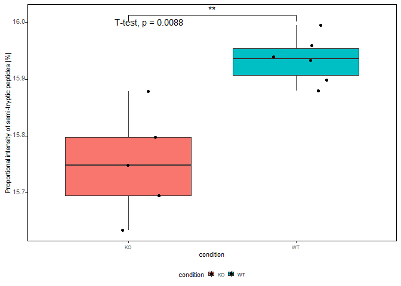<!-- -->

### Generate plot of sum of abundances semi-specific peptides

``` r
sum_semi_abunds <- ggplot(pept_summary_semi_1, 
                    aes(x = condition, 
                        y = `Summed Abundances`, fill = condition, 
                        cex.axis = 1.5)) +
  geom_boxplot() +
  #geom_dotplot(binaxis = "y", stackdir = "center", dotsize = 0.5,
  #             ) +
  geom_jitter(position=position_jitter(0.2)) + 
  # Box plot with jittered points
  # 0.2 : degree of jitter in x direction
  # geom_jitter(shape=16, position=position_jitter(0.2))
  ylab("Sum of log2-intensities of semi-tryptic peptides") +
  geom_signif(
    comparisons = list(c("WT", "KO")),
    map_signif_level = TRUE
  ) + 
  stat_compare_means(method="t.test") +
  theme(axis.text.x = element_text(hjust = 0.5, vjust = 0, size = 6, angle = 360),
        axis.text.y = element_text(hjust = 0.95, vjust = 0.2, size = 8),
        panel.background = element_blank(),
        panel.grid.major = element_blank(),
        panel.border = element_rect(colour = "black", fill=NA, size=0.5),
        axis.title = element_text(size = 8),
        legend.text = element_text(size = 6),
        legend.title = element_text(size = 8),
        legend.key.height= unit(3, 'mm'),
        legend.key.width= unit(3, 'mm'),
        legend.position="bottom")
```

``` r
print(sum_semi_abunds)
```

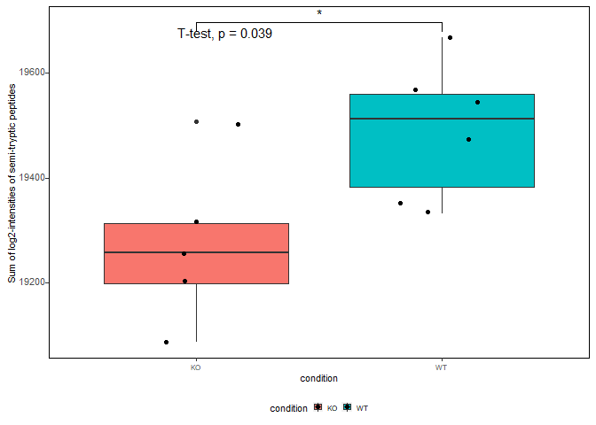<!-- -->

## Comparative analysis of semi-specific peptides vs protein abundance

### Prepare data

#### Get log2FC Summary of abundances of semi-specific peptides

``` r
#taking output from limma semi-specific
log2_semi_tryptic <- dplyr::select(compar_tab_interesting_pept,
                                   logFC, Protein, peptide, specificity, 
                                   is_terminal,
                                   Gene) %>%
  filter(specificity == "semi_specific",
         is_terminal == "not_terminal") %>%
  dplyr::rename(logFC_semi_peptide = logFC) %>%
  dplyr::select(-c(specificity, is_terminal))
```

#### Get log2 Summary of protein abundances based only on fully-tryptic peptides

``` r
med_prot_quant_specific <- pep_quant_presummary %>%
  group_by(protein, condition) %>%
  summarise(`median(Abundance)` = median(Abundance, na.rm = TRUE)) %>%
  ungroup()
```

``` r
# prep wide matrix for median proteins abundances (arousing only from fully-tryptic peptides)
wide_premat_prot_only_tryp <- med_prot_quant_specific %>%
  pivot_wider(id_cols = c("protein"),
              values_from = `median(Abundance)`, 
              names_from = condition) %>%
  dplyr::rename(Protein = protein) %>%
  mutate(logFC_fully_tryp_protein = log2(KO)-log2(WT)) %>%
                    left_join(.,prot2gene)

log2_fully_tryptic <- wide_premat_prot_only_tryp 
```

**Merge log2FCs of semi-tryptic peptides vs proteins with fully tryptic
peptides**

``` r
log2semipept2_log2protein_spec <- left_join(log2_fully_tryptic, log2_semi_tryptic) %>%
  na.omit() %>%
  mutate(DA_Protein = if_else(Protein %in% tab_sig_prots_tryptic$protein,
                              true = TRUE,
                              false = FALSE),
         DA_peptide = if_else(peptide %in% diff_abund_pept1$peptide,
                              true = TRUE,
                              false = FALSE))
```

``` r
check_pept <- cleavage_annoated_peptides %>%
  filter(peptide %in% c(increased_rec_pept, decreased_rec_pept))

inter_scater <- log2semipept2_log2protein_spec %>%
  filter(Protein %in% check_pept$protein_id)

scatter_proteolysis_plot <- ggplot(log2semipept2_log2protein_spec, 
                                   aes(x = logFC_fully_tryp_protein, 
                                       y = logFC_semi_peptide)) + 
  geom_smooth(method=lm, se = FALSE, linetype="dashed", size = 1, 
              color = "black") + 
  geom_point(aes(color = DA_Protein, shape = DA_peptide), size = 1) +
  scale_color_manual(values = c("#2a9d8f", "red")) +
  xlab("log2(FC) - Protein abundances") + 
  ylab("log2(FC) - Semi-specific peptides") + 
  #ggrepel::geom_text_repel(data = inter_scater,
  #                             aes(label = Gene), 
  #                         size = 1,
  #                         box.padding = 0.5,
  #                         max.overlaps = 25) +
  theme(axis.text.x = element_text(hjust = 0.5, vjust = 0, size = 8, angle = 360),
        axis.text.y = element_text(hjust = 0.95, vjust = 0.2, size = 8),
        panel.background = element_blank(),
        panel.grid.major = element_blank(),
        panel.border = element_rect(colour = "black", fill=NA, size=0.5),
        axis.title = element_text(size = 8),
        legend.text = element_text(size = 6),
        legend.title = element_text(size = 8),
        legend.key.height= unit(3, 'mm'),
        legend.key.width= unit(3, 'mm'),
        legend.position="bottom") 

cor.test(log2semipept2_log2protein_spec$logFC_semi_peptide,
    log2semipept2_log2protein_spec$logFC_fully_tryp_protein, method = "pearson")
```

    ## 
    ##  Pearson's product-moment correlation
    ## 
    ## data:  log2semipept2_log2protein_spec$logFC_semi_peptide and log2semipept2_log2protein_spec$logFC_fully_tryp_protein
    ## t = 63.588, df = 1426, p-value < 2.2e-16
    ## alternative hypothesis: true correlation is not equal to 0
    ## 95 percent confidence interval:
    ##  0.8456566 0.8727600
    ## sample estimates:
    ##       cor 
    ## 0.8598128

## Analysis of differential amino acid usage (iceLogo)

``` r
source(here("R/get_cleave_area.R"))
```

``` r
cleave_areas <- get_cleave_area(cleavage_annoated_peptides)
```

``` r
library(dagLogo)
```

**Load background proteome**

Used the identified protein sequences as background proteome.

``` r
proteome_ided <- prepareProteome(fasta = here("data-raw/protein.fas"), 
                                 species = "Mus musculus")
```

``` r
increased_Rec <- filter(cleave_areas$cleave_area20,
                            Peptide %in% increased_rec_pept)

decreased_Rec <- filter(cleave_areas$cleave_area20,
                            Peptide %in% decreased_rec_pept)

increased_Rec_4ice <- filter(cleave_areas$cleave_area20,
                            Peptide %in% increased_rec_pept) %>%
                    pull(cleave_area20)

decreased_Rec_4ice <- filter(cleave_areas$cleave_area20,
                            Peptide %in% decreased_rec_pept) %>%
                    pull(cleave_area20)
```

**Format peptide sequences**

``` r
if(!file.exists(here("report/outputs/formated_pept_daglogo_increased.rds"))){
  
  form_peptidesincreased_4ice <- formatSequence(increased_Rec_4ice, 
                                                proteome = proteome_ided)

  write_rds(form_peptidesincreased_4ice, file = here("report/outputs/formated_pept_daglogo_increased.rds"))
} else {
  
  form_peptidesincreased_4ice <- read_rds(here("report/outputs/formated_pept_daglogo_increased.rds"))
  
}
```

``` r
if(!file.exists(here("report/outputs/formated_pept_daglogo_decreased.rds"))){
  
  form_peptidesdecreased_4ice <- formatSequence(decreased_Rec_4ice, 
                                  proteome = proteome_ided)

  write_rds(form_peptidesdecreased_4ice, file = here("report/outputs/formated_pept_daglogo_decreased.rds"))
} else {
  
  form_peptidesdecreased_4ice <- read_rds(here("report/outputs/formated_pept_daglogo_decreased.rds"))
  
}
```

### Differential amino acid usage

#### Increased Proteolityc products

``` r
bg_mod_ztest_increased <- buildBackgroundModel(form_peptidesincreased_4ice,
                                           proteome = proteome_ided,
                           background = "wholeProteome",
                           testType = "ztest")
```

``` r
dau_nogroup_increased <- testDAU(form_peptidesincreased_4ice, 
                           dagBackground = bg_mod_ztest_increased)
```

``` r
dagHeatmap(dau_nogroup_increased) 
```

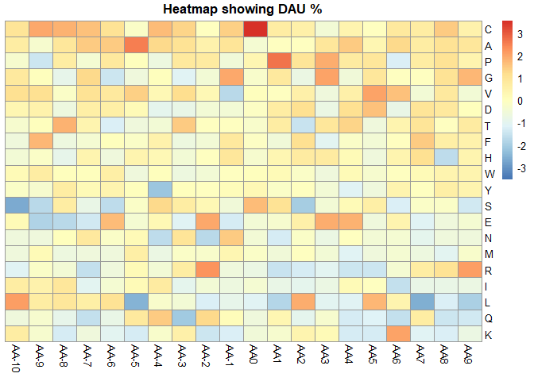<!-- -->

``` r
dagLogo(testDAUresults = dau_nogroup_increased, 
        pvalueCutoff = 0.05)
```

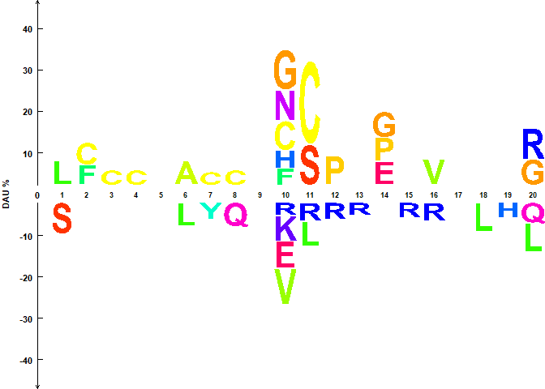<!-- -->
#### Decreased Proteolityc products

``` r
bg_mod_ztest_decreased <- buildBackgroundModel(form_peptidesdecreased_4ice,
                                           proteome = proteome_ided,
                           background = "wholeProteome",
                           testType = "ztest")
```

``` r
dau_nogroup_decreased <- testDAU(form_peptidesdecreased_4ice, 
                           dagBackground = bg_mod_ztest_decreased)
```

``` r
dagHeatmap(dau_nogroup_decreased) 
```

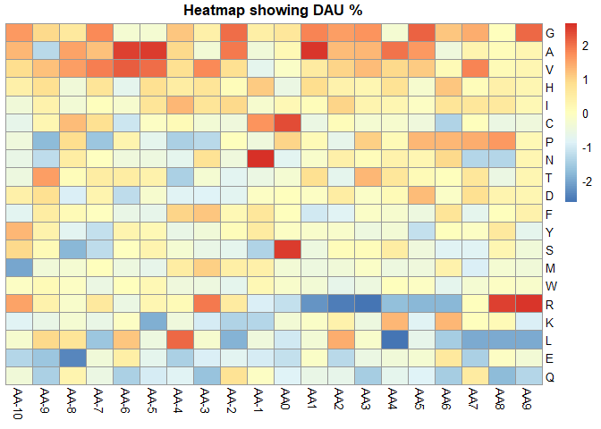<!-- -->

``` r
dagLogo(testDAUresults = dau_nogroup_decreased,
        pvalueCutoff = 0.05)
```

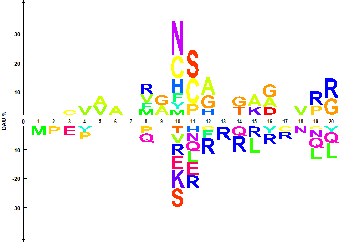<!-- -->
## Qualitative information from semi-specific peptides

### Location of (bio)chemical modifications

Another interesting aspect to explore from our peptide identifications
after TMT-labelling in the context of a N-terminomics workflow, relates
to the (bio)-chemical modifications observed and also the location of
these within the protein sequence.

In this workflow, we focus on two modifications: TMT-tag at N-termini,
and Acetylation at N-termini.

Based on our experimental context, TMT-tagged peptides at the N-termini
can be considered as real proteolytic products while Acetylated
N-termini are more likely to represent the mature protein N-termini.

We wrote functions to count the position of these modifications within
the protein sequence.

``` r
source(here("R/count_location_nterm.R"))
```

``` r
n_counts_comb <- count_location_nterm(nterm_annot = nterannot)
```

``` r
print(n_counts_comb$plot_aa_before)
```

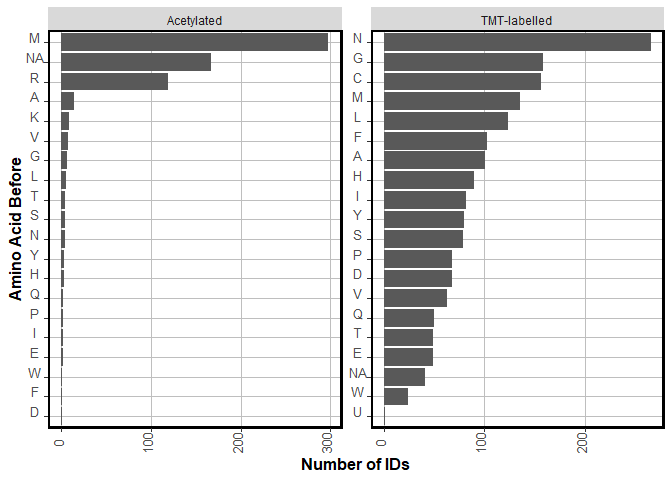<!-- -->

``` r
print(n_counts_comb$plot_normalized_location)
```

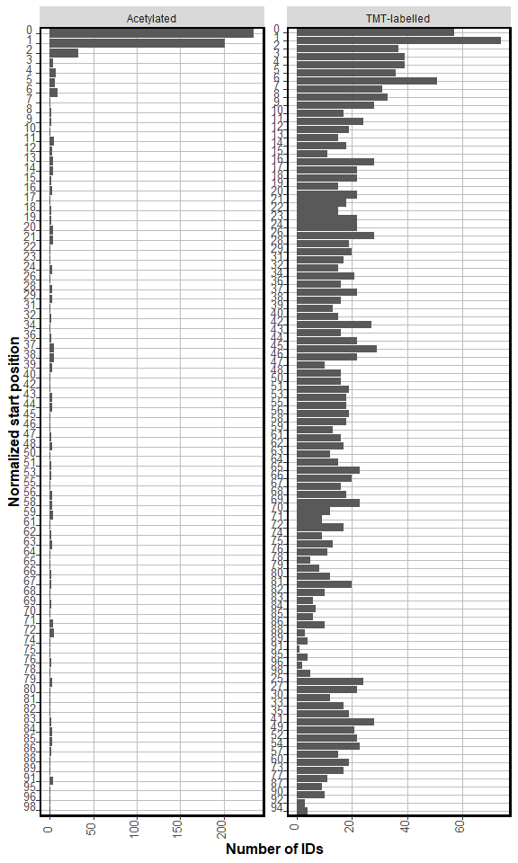<!-- -->
### Annotation of N-terminal peptides as canonical or not

Now we would like to use publicly available data to evaluate the
potential origin of the observed N-terminal peptides by comparing their
location against annotated processing sites in Uniprot.

For this purpose, we use the `drawProteins` R/Bioconductor package.

In the subsections below, we describe how to extract processing features
from Uniprot, and match/compare that information with the location of
N-terminal peptides identified in our experiment.

#### Get list of proteins identified with N-terminal peptides

``` r
protein_nter <- nterannot %>%
                    dplyr::select(protein_id, peptide, nterm, semi_type, specificity, 
                                  is_terminal, last_aa, aa_before, start_position, end_position) %>%
                    dplyr::filter(str_detect(protein_id, pattern = "Biognosys", negate = TRUE),
                                  specificity == "semi_specific",
                                  nterm %in% c("TMT-labelled", "acetylated"))

protein_ids_nter <- protein_nter$protein_id %>%
                    unique()
```

**Nr of identified proteins with N-term**

``` r
length(protein_ids_nter)
```

    ## [1] 691

#### Download Uniprot Processing Features

We use the `get_features` function from `drawProteins` in combination
with `purrr` to download the annotated features of the interesting
proteins using the Uniprot API.

``` r
if(!file.exists(here("report/outputs/uniprot_features_pkd.rds"))){
  time1 <- Sys.time()
  uniprot_features <- purrr::map(.x = protein_ids_nter,
                                 .f = drawProteins::get_features)
  time2 <- Sys.time()
  
  write_rds(uniprot_features, 
            file = here("report/outputs/uniprot_features_pkd.rds"))
  
  time_taken <- time2 - time1
  
  write_rds(time_taken, 
            file = here("report/outputs/uniprot_features_pkd_time.rds"))
} else {
  
  uniprot_features <- read_rds(here("report/outputs/uniprot_features_pkd.rds"))
  
  time_taken <- read_rds(here("report/outputs/uniprot_features_pkd_time.rds"))

}
```

**Get features into a data frame format**

``` r
df_uniprot_features <- purrr::map(uniprot_features,
                          drawProteins::feature_to_dataframe)

df_features_df <- bind_rows(df_uniprot_features)  
```

#### Match N-term peptides with processing annotation

Then, we want to keep only features associated with post-processing and
match the semi-specific cleavage positions vs the end location of the
annotated processing sites of the associated protein. Three (+/- 3)
amino acid residues were accepted. Then, the matched locations are
categorized according to the type of processing associated to it and
visualizations are generated.

We bundled this process in the function `categorize_nterm`.

``` r
source(here("R/categorize_nterm.R"))
```

``` r
categorized_ntermini <- categorize_nterm(annotated_peptides = nterannot, 
                                         uniprot_features = df_uniprot_features)
```

``` r
print(categorized_ntermini$ntermini_category_plot)
```

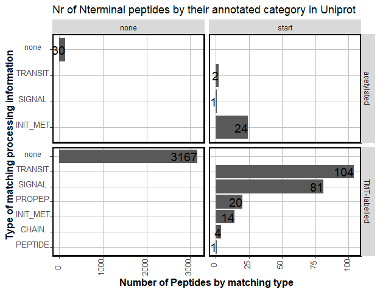<!-- -->
