```r
knitr::opts_chunk$set(echo = TRUE, 
                      message = FALSE, 
                      warning = FALSE)
```


# Initializing package  

__Installation__


```r
devtools::install_github("MiguelCos/fragNterminomics")
```
__Loading__


```r
library(fragNterminomics)
```

# General experimental information

In order to showcase the capabilities of modern bioformatics tools in combination with our data analysis approach to extract information related to proteolytic processing from shotgun proteomics data (i.e. without biochemical enrichment), we used a mouse model of polycystic kidney disease (PKD) and isobaric labeling at the protein level.

In brief, protein was extracted from 11 Formalin-fixed paraffin-embedded (FFPE) tissue samples and directly labeled before trypsin digestion using TMT 11plex. Using this approach, we aimed to identify and quantify both native and neo N-termini; in the later case, assuming that peptides TMT-labelled at their N-termini would be those coming from intrinsic proteolytic processing.

The general annotation of the samples is outlined below, with wild-type (WT) samples representing the control and knock-out (KO) representing the polycystic kidneys.


```r
# load the tabular information from the samples
sample_annotation <- fragNterminomics::sample_annotation
```

<table class="table table-striped table-hover" style="font-size: 14px; margin-left: auto; margin-right: auto;">
 <thead>
  <tr>
   <th style="text-align:left;"> channel </th>
   <th style="text-align:left;"> sample_id </th>
   <th style="text-align:left;"> condition </th>
  </tr>
 </thead>
<tbody>
  <tr>
   <td style="text-align:left;"> 126 </td>
   <td style="text-align:left;"> WT1 </td>
   <td style="text-align:left;"> WT </td>
  </tr>
  <tr>
   <td style="text-align:left;"> 127N </td>
   <td style="text-align:left;"> KO1 </td>
   <td style="text-align:left;"> KO </td>
  </tr>
  <tr>
   <td style="text-align:left;"> 127C </td>
   <td style="text-align:left;"> WT2 </td>
   <td style="text-align:left;"> WT </td>
  </tr>
  <tr>
   <td style="text-align:left;"> 128N </td>
   <td style="text-align:left;"> KO2 </td>
   <td style="text-align:left;"> KO </td>
  </tr>
  <tr>
   <td style="text-align:left;"> 128C </td>
   <td style="text-align:left;"> WT3 </td>
   <td style="text-align:left;"> WT </td>
  </tr>
  <tr>
   <td style="text-align:left;"> 129N </td>
   <td style="text-align:left;"> KO3 </td>
   <td style="text-align:left;"> KO </td>
  </tr>
  <tr>
   <td style="text-align:left;"> 129C </td>
   <td style="text-align:left;"> WT4 </td>
   <td style="text-align:left;"> WT </td>
  </tr>
  <tr>
   <td style="text-align:left;"> 130N </td>
   <td style="text-align:left;"> KO4 </td>
   <td style="text-align:left;"> KO </td>
  </tr>
  <tr>
   <td style="text-align:left;"> 130C </td>
   <td style="text-align:left;"> WT5 </td>
   <td style="text-align:left;"> WT </td>
  </tr>
  <tr>
   <td style="text-align:left;"> 131N </td>
   <td style="text-align:left;"> KO5 </td>
   <td style="text-align:left;"> KO </td>
  </tr>
  <tr>
   <td style="text-align:left;"> 131C </td>
   <td style="text-align:left;"> WT6 </td>
   <td style="text-align:left;"> WT </td>
  </tr>
</tbody>
</table>

# Background and general description of the data analysis approach

The extraction of information regarding proteolytic processing from shotgun mass-spectrometry(MS)-based proteomics data realies heavily on the confident identification of peptides that do not arise from experimental proteolytic digestion (i.e. tryptic peptides). These so-called 'semi-specific' peptides represent only \~5-15% of the sample, but allowing their identification by peptide-to-spectrum matching (PSM) algorithms (i.e. search engines) imposes an increased search space and therefore a complication in terms of false discovery rate control.

Modern search engines such as MSFragger allow for very fast searches, which is specially useful when having increased search spaces. In a similar sense, the use of probabilistic modeling for post-processing and validating PSMs (i.e., peptideProphet/Percolator) allows for the reliable identification of an increased number of peptides, even when faced with increased search spaces.

Based on this observation, we aimed to establish a data analysis workflow that would allow to exploit these capacities of modern algorithms for the large-scale identification and quantitation of products of proteolytic processing from shotgun proteomics data (without biochemical enrichment) and place this information into biological and clinical context.

## Short description of database search and quantitation approach

We used the FragPipe (v17.1) bioinformatic pipeline for database search, re-scoring and quantitation.

In brief, we used MSFragger for peptide-to-spectrum matching against canonical mouse sequences (EBI reference proteomes, version 2021_04). We used *argc* semi-specificity (cleavage only at R), based on the assumption that trypsin would not cleave at K after TMT labeling. Acetylation at peptide N-term and TMT-labeling at N-term where both set as variable modifications. TMT at K and carbamidomethylation of C were set as fixed modifications.

MSBooster was to predict spectra and retention times which were used as an input for Percolator for probabilistic rescoring and FDR control of peptide identifications.

The TMT-integrator module was used for extraction and normalization of quantitative information from MS2 reporter ions.

Tabular outputs were exported into R using R studio and further processing is described in detail in the following sections.

# Required files from the FragPipe search results

The example usage of this data analysis approach would be based on a typical TMT quantitation search using FragPipe, although some of the functions can be used in label-free experiments.

For quantitative analysis, we would need normalized abundance values of the peptides and proteins idenfied and quantified after filtering by the `TMT-integrator` module. These files can typically be found in a subfolder `tmt-report` in the search results folder and named `abundance_protein_MD.tsv` for protein abundances and `abundance_peptide_MD.tsv` for peptide abundances.

We have included the sample outputs from our search in this repo, and can be loaded as follows:


```r
prot_abund_mat <- fragNterminomics::prot_abund_mat

pept_abund_mat <- fragNterminomics::pept_abund_mat
```

We also want the complete list of identified peptides and proteins, including the identified modifications and their locations. We need this information in order to be able to define peptides as semi-specific or not, and also to annotate their (bio)-chemical modifications. All this is important for later labeling of the identified peptides as proteolytic products or not. In our example, the tabular lists of peptides and proteins can be found as `protein.tsv` and `peptide.tsv` in the FragPipe output.


```r
prot_ident <- fragNterminomics::prot_ident

pept_ident <- fragNterminomics::pept_ident
```

Finally, we want a FASTA file containing, at least, all the proteins identified in our experiment (therefore found in the tabular outputs loaded above). FragPipe writes a FASTA file of identified proteins for each TMT mixture in the experiment. We can find it as `protein.fas` in our example. The user can also use the FASTA file used for the search.

We use the `read.fasta` function from the `seqinr` package. Setting the parameter `as.string = TRUE` . This is important for later annotation of the identified peptides.


```r
fasta <- fragNterminomics::fasta
```

The `clean_names` function from the `janitor` package was used to have consistent column names in the loaded data frames.

# General proteomics analysis

In first instance, we want evaluate the general proteome biology of our experimental system, including quantitative quality control, unsupervised statistics and differential expression analyses.

We will continue afterwards with the analysis of proteolytic processing, but the initial exploration of the proteome biology would give us an overview of the behavior of the biological system in study.

## Initial data wrangling

**Wrangling and prep for visualization**

We want to prepare the data for exploratory visualization and further statistical analysis.We start with preparing the abundance matrices, containing 1 row per protein and 1 column per sample, and further processing them with sample annotation information as a preparation for exploratory and differential analyses.


```r
# protein level ----

# prepare wide abundance data frame from abundance_protein_MD.tsv
# we keep only the identifier (index) and the columns containing quantitative info per sample
prot_mat <- dplyr::select(prot_abund_mat,
                          Protein = index, # protein identifier column
                          starts_with("wt"), # columns with quant of WT samples 
                          starts_with("ko")) # columns with quant of KO samples 

# long abundance data frame
# long abundance table, with 1 row per quantitative observation for visualizations
prot_mat_long <- pivot_longer(prot_mat,
                              cols = c(starts_with("wt"),
                                       starts_with("ko")),
                              names_to = "sample_id",
                              values_to = "Abundance") %>%
                    mutate(condition = if_else(str_detect(string = sample_id, 
                                                          pattern = "ko", 
                                                          negate = FALSE), 
                                               true = "KO",
                                               false = "WT"),
                           sample_id = str_to_upper(sample_id))

# long abundance table with annotation 
# merging the long abundance data frame with sample annotation
quant_annot <- left_join(prot_mat_long,
                         sample_annotation)


# wide abundance matrix without NAs 
# eliminate all the proteins with missing values in any sample
# this matrix will be used for differential statistics
prot_matnona <- column_to_rownames(prot_mat,
                                   "Protein") %>%
                    as.matrix() %>% # define as a matrix object
                    na.omit()

# peptide level ---- 

# wide abundance data frame
pept_mat <- dplyr::select(pept_abund_mat,
                          Peptide = index,
                          starts_with("wt"), 
                          starts_with("ko"))

# long abundance matrix
pept_mat_long <- pivot_longer(pept_mat,
                              cols = c(starts_with("wt"),
                                       starts_with("ko")),
                              names_to = "sample_id",
                              values_to = "Abundance") %>%
                    mutate(condition = if_else(str_detect(string = sample_id, 
                                                          pattern = "ko", 
                                                          negate = FALSE), 
                                               true = "KO",
                                               false = "WT"),
                           sample_id = str_to_upper(sample_id))

# long abundance table with annotation 
quant_annot_pept <- left_join(pept_mat_long,
                              sample_annotation) %>%
                    dplyr::rename(index = Peptide)

# wide abundance matrix without NAs 
pept_matnona <- column_to_rownames(pept_mat,
                                   "Peptide") %>%
                    as.matrix() %>% # define as matrix
                    na.omit()

# wide abundance data frame without NAs, tmt-report information
pept_abund_mat_nona <- pept_abund_mat %>% 
                    filter(index %in% rownames(pept_matnona))
```

## ID coverage

Now we can start with exploring our results.

After search and post-processing, these are the number of peptides and proteins identified in all of our samples:

Nr of proteins identified and quantified in all samples: 5225

Nr of peptides identified and quantified in all samples: 20879

## QC plots after TMT integrator pre-processing and normalization

### By TMT channel/sample

We want to check if the general distribution of protein normalized abundances after normalization by TMT integrator show a normal and consistent distribution between samples.


```r
qcplot <- ggplot(quant_annot,
                 mapping = aes(x = channel, 
                               y = Abundance, 
                               fill = condition)) +
          geom_boxplot() + 
          theme(axis.text.x = element_text(hjust = 0.5, 
                                           vjust = 0.1, 
                                           size = 10, 
                                           angle = 90),
                axis.text.y = element_text(hjust = 0.5, 
                                           vjust = 0.1, 
                                           size = 10),
                panel.background = element_blank(),
                panel.grid.major = element_line(color = "grey"),
                panel.border = element_rect(colour = "black", 
                                            fill = NA, 
                                            size = 1.5),
                axis.title=element_text(size=12,
                                        face="bold"))

print(qcplot)
```

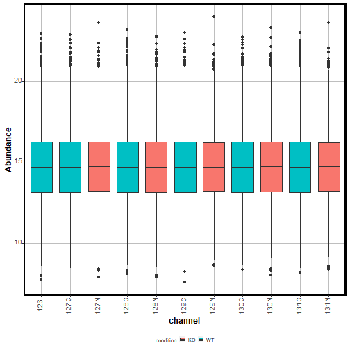

We observe that there is consistent normal distribution of abundances between samples, allowing for comparisons and further statistical processing.

### By Protein

We also want to evaluate if abundances within each protein follow a normal distribution, which is an assumption for the linear models used for differential abundance analysis.

We use the `sample_proteins` function from our helper functions to randomly select a set of 50 identified and quantified proteins.


```r
which_prots <- sample_proteins(x = quant_annot$Protein,
                               size = 50,
                               seed = 156)
```

Then we plot the abundance distribution of these proteins.


```r
qcplot_prots <- ggplot(quant_annot %>% 
                         filter(Protein %in% which_prots),
                 mapping = aes(x = reorder(Protein,Abundance,na.rm = TRUE), 
                               y = Abundance)) +
          geom_boxplot() + 
          geom_jitter(color="black", size=0.4, alpha=0.9) +
          labs(subtitle = "Protein IDs arranged by median abudance",
               x = "Protein ID ") + 
          theme(axis.text.x = element_text(hjust = 0.5, vjust = 0.1, size = 10, angle = 90),
                axis.text.y = element_text(hjust = 0.5, vjust = 0.1, size = 10),
                panel.background = element_blank(),
                panel.grid.major = element_line(color = "grey"),
                panel.border = element_rect(colour = "black", fill=NA, size=1.5),
                axis.title=element_text(size=12,face="bold"))

print(qcplot_prots)
```

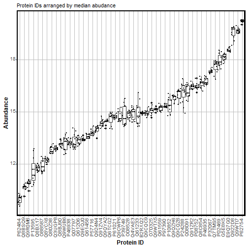

We can observe that, in general, the proteins show a normal distribution in terms of their normalized abundance values after TMT integrator.

## Exploratory PCA

A powerful way to evaluate if protein abundance itself can help differentiate between experimental or clinical groups is performing a principal component analysis based on the protein abundances, and visualizing the samples in terms of the 2 first components. For this purpose, we make use of the `mixOmics` package.

As first step, we need a transposed matrix of protein abundances, in which we 1 row for each sample and 1 column for each protein:


```r
t_prot_matnona <- t(prot_matnona)
```

Then we can execute the PCA on the transposed matrix:


```r
pca_res = pca(t_prot_matnona, 
              ncomp = 10, 
              center = TRUE, 
              scale = TRUE)
```

And plot the variance explained per component.


```r
plot(pca_res)
```

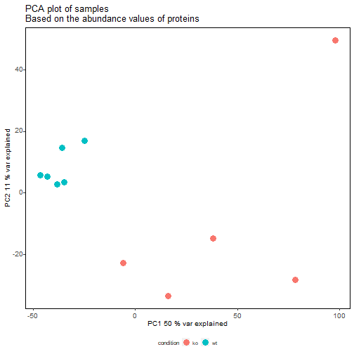

\~60% of the variance based on protein abundance can be explained by components 1 and 2 after PCA.

### PCA plot on samples based on protein abundance

We can then extract the quantitative information of PCA variate to prepare a data frame in combination with sample annotation information


```r
# preprocess pca results 
pca_variates <- pca_res$variates$X %>% 
  as.data.frame() %>%
  rownames_to_column("Sample") %>%
  mutate(condition = if_else(str_detect(Sample, "wt"), # generate a condition column
                             true = "wt",
                             false = "ko")) 
```

We can then use the resulting object for visualization of the PCA results:


```r
ggplot(data = pca_variates,
       aes(x = PC1, 
           y = PC2)) +
  geom_point(size = 4, aes(color = condition)) +  
  labs(title = "PCA plot of samples\nBased on the abundance values of proteins") +
  xlab(paste("PC1", round(pca_res$prop_expl_var$X[1]*100), "% var explained")) + 
  ylab(paste("PC2", round(pca_res$prop_expl_var$X[2]*100), "% var explained")) + 
  theme(axis.text.x = element_text(hjust = 0.5, vjust = 0, size = 10, angle = 360),
        axis.text.y = element_text(hjust = 0.95, vjust = 0.2, size = 10),
        panel.background = element_blank(),
        panel.grid.major = element_blank(),
        panel.border = element_rect(colour = "black", fill=NA, size=0.5),
        axis.title = element_text(size = 10),
        legend.text = element_text(size = 7),
        legend.title = element_text(size = 8),
        legend.key.height= unit(3, 'mm'),
        legend.key.width= unit(3, 'mm'),
        legend.position="bottom")
```


The PCA allow us to observe a striking difference in the proteome between WT and KO samples.

### Differential Expression Analysis

Now we can procede with a differential expression analysis, to evaluate which proteins are those that differ in their abundances between the two experimental/clinical conditions.

We will use `limma` for our differential expression analyses. Therefore we need an expression matrix (already prepared, object `prot_matnona` created above) and a design matrix, defining our experimental design.

For visualization and further interpretation purposes, we first generate a data frame mapping Protein/Uniprot IDs to their Gene/Symbol IDs.


```r
prot2gene <- prot_abund_mat %>%
  dplyr::select(Protein = index, Gene = gene)
```

#### Set up design matrix

We need to have a design matrix to map the columns of our expression matrix to their corresponding experimental/clinical condition.

First we can extract a condition vector from the column names of our expression matrix.


```r
condition <- colnames(prot_matnona) %>% # extract column names
                    str_sub(start = 1, # extract first 2 characters of each name
                            end = 2) %>% # this correspond to the condition
                    factor(levels = c("wt", "ko")) # set the out as a factor, a force WT as the baseline
```

We can now use the `condition` vector as an input for the `model.matrix` function which will create a design matrix setting WT as the baseline and KO as the treatment group in this example.


```r
design <- model.matrix(~condition)
```

Check design matrix


```r
print(design)
```

```
##    (Intercept) conditionko
## 1            1           0
## 2            1           0
## 3            1           0
## 4            1           0
## 5            1           0
## 6            1           0
## 7            1           1
## 8            1           1
## 9            1           1
## 10           1           1
## 11           1           1
## attr(,"assign")
## [1] 0 1
## attr(,"contrasts")
## attr(,"contrasts")$condition
## [1] "contr.treatment"
```

We can see that the first 6 rows of the design matrix have `0` values in their `conditionko` column and `1` values in the last 5 rows. This matches with the fact that, in our expression matrix, our first 6 columns represent WT samples while the last 5 columns represent KO samples.

#### Fit limma

We can now use the expression matrix and design matrix to run our `limma` analysis and visualize it using a volcano plot.


```r
# fit linear model
fit_prot <- lmFit(prot_matnona, 
                  design = design,
                  method = 'robust') 

# apply moderated bayesian statistics
fit_eb <- eBayes(fit_prot)

# extract tabular output of differential expression results  
limma_tab <- topTable(fit_eb, 
                      coef = 2, # coef = 2 corresponds to column 2 of design matrix
                      number = Inf) %>%
                    rownames_to_column("Protein") %>% # create a Protein column
                    left_join(.,prot2gene) # merge with protein-to-gene annotation
```

#### Volcano plot


```r
our_volcano(limma_tab, 
            FC_cutoff = 0, 
            pval_cutoff = 0.05, 
            color_diffex = "red", 
            color_nondifex = "#2a9d8f", 
            interesting_proteins = NULL, 
            vert_line_col = "red",
            hline_col = "red", 
            hline_pos = 0.05, 
            linetype = "dashed",
            increased_in = "KO", 
            comparison_title = "KO vs WT") +
  theme(axis.text.x = element_text(hjust = 0.5, vjust = 0, size = 10, angle = 360),
        axis.text.y = element_text(hjust = 0.95, vjust = 0.2, size = 10),
        panel.background = element_blank(),
        panel.grid.major = element_blank(),
        panel.border = element_rect(colour = "black", fill=NA, size=0.5),
        axis.title = element_text(size = 10),
        legend.text = element_text(size = 7),
        legend.title = element_text(size = 8),
        legend.key.height= unit(3, 'mm'),
        legend.key.width= unit(3, 'mm'),
        legend.position="bottom") 
```

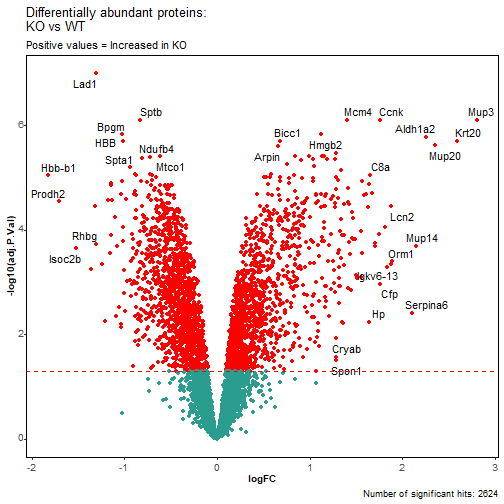

In correspondence with what was observed after PCA, we see an important fraction of identified proteins as differentially expressed between the two studied phenotypes.

#### Enrichment analyses

We then perform functional enrichment analyses to identify which biological motivs are more prevalent among differentially abundant proteins. In this case, we use the `clusterProfiler` and `ReactomePA` packages.

As input, we need to prepare our differentially abundant proteins into a data frame.


```r
# vector of proteins increased in ko
increased_in_ko <- limma_tab %>%
                    filter(logFC > 0 ,
                           adj.P.Val < 0.05) %>%
                    pull(Protein)

# vector of proteins decreased in ko
decreased_in_ko <- limma_tab %>%
                    filter(logFC < 0 ,
                           adj.P.Val < 0.05) %>%
                    pull(Protein)

# create a data frame with differentially abundant proteins and their 'direction'
ab_sig_prots_tryptic <- bind_rows(tibble(protein = increased_in_ko,
                                  characteristic = "up-regulated"),
                           tibble(protein = decreased_in_ko,
                                  characteristic = "down-regulated"))

# translate uniprot IDs to SYMBOL and ENTREZIDs from differentially abundant proteins
# this is required for Reactome enrichment analyses
unip2symb_tryptic <- bitr(ab_sig_prots_tryptic$protein, 
                  fromType = "UNIPROT", 
                  toType = c("SYMBOL", "ENTREZID"),
                  OrgDb = org.Mm.eg.db) %>%
  dplyr::rename(protein = UNIPROT) %>%
  mutate(Protein = protein)

# merge data frame of differentially abundant proteins and their SYMBOL/ENTREZIDs
tab_sig_prots_tryptic <- left_join(ab_sig_prots_tryptic, 
                                   unip2symb_tryptic)

# generate list of ENTREZIDs of all the identified proteins
# this is necessary to be used as background proteome for the enrichment analysis
unip2symbIDed_tryptic <- bitr(prot_ident$protein_id, 
                  fromType = "UNIPROT", 
                  toType = c("SYMBOL", "ENTREZID"),
                  OrgDb = org.Mm.eg.db)
```

### Reactome

Execute the Reactome-based enrichment analysis.


```r
group_comparison_react <- compareCluster(ENTREZID~characteristic, 
                                              data=tab_sig_prots_tryptic, 
                                              fun="enrichPathway",
                                              organism = "mouse",
                                              pvalueCutoff = 0.05,
                                              pAdjustMethod = "BH",
                                              qvalueCutoff = 0.2,
                                              universe = unip2symbIDed_tryptic$ENTREZID,
                                              minGSSize = 10,
                                              maxGSSize = 1000,
                                              readable = TRUE)
```

##### Dotplot Reactome

Visualize the enrichment analysis results.


```r
enrichpl <- enrichplot::dotplot(group_comparison_react, x = "characteristic") + 
  scale_color_continuous(low="red", 
                         high="blue",
                         guide=guide_colorbar(reverse=TRUE),
                         breaks = c(0.01, 
                                    0.04)) + 
  ggtitle("Enrichment analysis results - Reactome", 
          subtitle = "Up-regulated = 'increased in KO phenotype'")
```

```r
  theme(axis.text.x = element_text(hjust = 0.5, vjust = 0, size = 8, angle = 360),
        axis.text.y = element_text(hjust = 0.95, vjust = 0.2, size = 7),
        panel.background = element_blank(),
        panel.border = element_rect(colour = "black", fill=NA, size=0.5),
        axis.title.x = element_blank(),
        axis.title.y = element_blank(),
        legend.text = element_text(size = 7),
        legend.title = element_text(size = 8),
        legend.key.height= unit(3, 'mm'),
        legend.key.width= unit(3, 'mm'),
        legend.position="bottom")
```

```
## List of 11
##  $ axis.title.x     : list()
##   ..- attr(*, "class")= chr [1:2] "element_blank" "element"
##  $ axis.title.y     : list()
##   ..- attr(*, "class")= chr [1:2] "element_blank" "element"
##  $ axis.text.x      :List of 11
##   ..$ family       : NULL
##   ..$ face         : NULL
##   ..$ colour       : NULL
##   ..$ size         : num 8
##   ..$ hjust        : num 0.5
##   ..$ vjust        : num 0
##   ..$ angle        : num 360
##   ..$ lineheight   : NULL
##   ..$ margin       : NULL
##   ..$ debug        : NULL
##   ..$ inherit.blank: logi FALSE
##   ..- attr(*, "class")= chr [1:2] "element_text" "element"
##  $ axis.text.y      :List of 11
##   ..$ family       : NULL
##   ..$ face         : NULL
##   ..$ colour       : NULL
##   ..$ size         : num 7
##   ..$ hjust        : num 0.95
##   ..$ vjust        : num 0.2
##   ..$ angle        : NULL
##   ..$ lineheight   : NULL
##   ..$ margin       : NULL
##   ..$ debug        : NULL
##   ..$ inherit.blank: logi FALSE
##   ..- attr(*, "class")= chr [1:2] "element_text" "element"
##  $ legend.key.height: 'simpleUnit' num 3mm
##   ..- attr(*, "unit")= int 7
##  $ legend.key.width : 'simpleUnit' num 3mm
##   ..- attr(*, "unit")= int 7
##  $ legend.text      :List of 11
##   ..$ family       : NULL
##   ..$ face         : NULL
##   ..$ colour       : NULL
##   ..$ size         : num 7
##   ..$ hjust        : NULL
##   ..$ vjust        : NULL
##   ..$ angle        : NULL
##   ..$ lineheight   : NULL
##   ..$ margin       : NULL
##   ..$ debug        : NULL
##   ..$ inherit.blank: logi FALSE
##   ..- attr(*, "class")= chr [1:2] "element_text" "element"
##  $ legend.title     :List of 11
##   ..$ family       : NULL
##   ..$ face         : NULL
##   ..$ colour       : NULL
##   ..$ size         : num 8
##   ..$ hjust        : NULL
##   ..$ vjust        : NULL
##   ..$ angle        : NULL
##   ..$ lineheight   : NULL
##   ..$ margin       : NULL
##   ..$ debug        : NULL
##   ..$ inherit.blank: logi FALSE
##   ..- attr(*, "class")= chr [1:2] "element_text" "element"
##  $ legend.position  : chr "bottom"
##  $ panel.background : list()
##   ..- attr(*, "class")= chr [1:2] "element_blank" "element"
##  $ panel.border     :List of 5
##   ..$ fill         : logi NA
##   ..$ colour       : chr "black"
##   ..$ size         : num 0.5
##   ..$ linetype     : NULL
##   ..$ inherit.blank: logi FALSE
##   ..- attr(*, "class")= chr [1:2] "element_rect" "element"
##  - attr(*, "class")= chr [1:2] "theme" "gg"
##  - attr(*, "complete")= logi FALSE
##  - attr(*, "validate")= logi TRUE
```


```r
print(enrichpl)
```

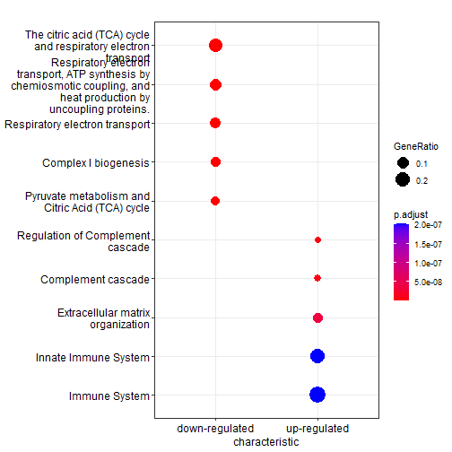

We can observe that there is a differentiated biological fingerprint between KO vs WT phenotypes. Proteins up-regulated in KO are mostly markers of immune response and ECM organization, while downregulated proteins are those associated with energy metabolism.

# Analysis of proteolytic processing

Now that we have observed that we can extract consistent and reliable biological information from our experimental/clinical system, we can process with the peptide-level analysis and the extraction of information related to proteolytic processing.

## QC plots

In first instance, we start with QC plots for quantitation at the peptide level.

### By TMT channel/sample


```r
qcplot_pept <- ggplot(quant_annot_pept,
                 mapping = aes(x = channel, 
                               y = Abundance, 
                               fill = condition)) +
          geom_boxplot() + 
          #facet_grid(.~recurrence, scales = "free") +
          theme(axis.text.x = element_text(hjust = 0.5, 
                                           vjust = 0.1, 
                                           size = 10, 
                                           angle = 90),
                axis.text.y = element_text(hjust = 0.5, 
                                           vjust = 0.1, 
                                           size = 10),
                panel.background = element_blank(),
                panel.grid.major = element_line(color = "grey"),
                panel.border = element_rect(colour = "black", 
                                            fill = NA, 
                                            size = 1.5),
                axis.title=element_text(size = 12,
                                        face = "bold"))

print(qcplot_pept)
```

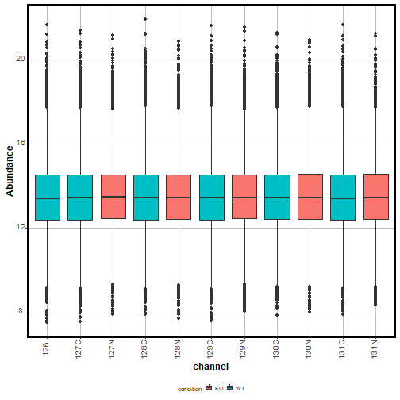

### By Protein


```r
which_pept <- sample_proteins(x = quant_annot_pept$index,
                               size = 50,
                               seed = 156)
```


```r
qcplot_pept <- ggplot(quant_annot_pept %>% 
                         filter(index %in% which_pept),
                 mapping = aes(x = reorder(index,
                                           Abundance,
                                           na.rm = TRUE), 
                               y = Abundance)) +
          geom_boxplot() + 
          geom_jitter(color="black", size=0.4, alpha=0.9) +
          labs(subtitle = "Peptide IDs arranged by median abudance",
               x = "Peptide_Protein ID") + 
          theme(axis.text.x = element_text(hjust = 1, 
                                           vjust = 0.1, 
                                           size = 4, 
                                           angle = 90),
                axis.text.y = element_text(hjust = 0.5, 
                                           vjust = 0.1, 
                                           size = 10),
                panel.background = element_blank(),
                panel.grid.major = element_line(color = "grey"),
                panel.border = element_rect(colour = "black", 
                                            fill=NA, 
                                            size=1.5),
                axis.title=element_text(size=12,
                                        face="bold"))

print(qcplot_pept)
```

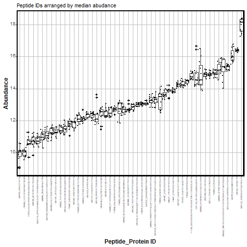

## Annotate peptides (specificity)

The first step for analyzing semi-specific search results in terms of large scale analysis of proteolytic activity is to annotate the identified peptides by their specificity.

We do that in the context of this data analysis approach with the `annotate_peptides` function.

We need to prepare the input data frame for the `annotate_peptides` function. Requirements: a data frame with at least 2 columns: `Genes`, with uniprot IDs and `Peptides`, with sequences of the identified peptides.

First, let's check the data frame with the identified peptides.


```r
head(pept_ident)
```

```
## # A tibble: 6 x 33
##   peptide  prev_aa next_aa peptide_length charges probability spectral_count intensity
##   <chr>    <chr>   <chr>            <dbl> <chr>         <dbl>          <dbl>     <dbl>
## 1 AAAAAAA~ R       F                   44 5, 6          0.999              2   318955.
## 2 AAAAAAA~ M       G                   16 2             1.00               2        0 
## 3 AAAAAAA~ A       R                   21 2             0.904              1        0 
## 4 AAAAAAA~ F       K                   12 3             0.993              2        0 
## 5 AAAAAAS~ M       E                   15 2             1                  1        0 
## 6 AAAAATA~ M       V                   18 2, 3          1                  7  9052923.
## # ... with 25 more variables: assigned_modifications <chr>,
## #   observed_modifications <lgl>, protein <chr>, protein_id <chr>, entry_name <chr>,
## #   gene <chr>, protein_description <chr>, mapped_genes <chr>, mapped_proteins <chr>,
## #   wt1 <dbl>, ko1 <dbl>, wt2 <dbl>, ko2 <dbl>, wt3 <dbl>, ko3 <dbl>, wt4 <dbl>,
## #   ko4 <dbl>, wt5 <dbl>, ko5 <dbl>, wt6 <dbl>, mt_29 <dbl>, mt_30 <dbl>,
## #   mt_31 <dbl>, mt_32 <dbl>, mt_33 <dbl>
```

Get the two interesting columns and change the names.


```r
pepto_annot <- dplyr::select(pept_ident,
                             Peptide = peptide, 
                             Genes = protein_id)
```


```r
if(!file.exists(here("report/outputs/cleavage_annoated_peptides_final.tsv"))){
  cleavage_annoated_peptides <- annotate_peptides(peptide2protein = pepto_annot, 
                                                  fasta = fasta,
                                                  decoy_tag = "rev_")
  
  write_tsv(cleavage_annoated_peptides, here("report/outputs/cleavage_annoated_peptides_final.tsv"))
} else {
  cleavage_annoated_peptides <- read_tsv(here("report/outputs/cleavage_annoated_peptides_final.tsv"))
}
```

## Annotate peptides (N-term modification)

After annotating the peptides by their specificity, we want to evaluate the chemical modifications found at the N-term. In the context of this experimental design, we are able to use the TMT labelling at the N-term as a corroboration of the origin of the identified peptide as a proteolytic product.

Merging table of specificity-labelled peptide with identifications table:


```r
cleavage_annoated_peptides <- dplyr::mutate(cleavage_annoated_peptides,
                                            Genes = protein_id) %>% 
                    dplyr::mutate(peptide = Peptide)

peptides_annotated <- left_join(pept_ident, 
                                cleavage_annoated_peptides,
                                by = c("peptide", 
                                       "protein_id"))
```


```r
nterannot <- annotate_nterm(peptides_annotated,
                            tmtmass = 304.2072) %>%
                    clean_names()
```


## Summarize peptide counts per feature

We will use the function `summarize_peptide_counts`, which will help us see to counts of identified peptides per interesting feature in terms of specificity and (bio)chemical modifications.


```r
summary_count <- summarize_peptide_counts(nterannot) 
```


```r
kbl(summary_count, booktabs = TRUE) %>%
  kable_styling(font_size = 14,
                bootstrap_options = c("striped", "hover"))
```

<table class="table table-striped table-hover" style="font-size: 14px; margin-left: auto; margin-right: auto;">
 <thead>
  <tr>
   <th style="text-align:left;"> feature_type </th>
   <th style="text-align:right;"> n </th>
   <th style="text-align:left;"> category </th>
  </tr>
 </thead>
<tbody>
  <tr>
   <td style="text-align:left;"> semi_specific </td>
   <td style="text-align:right;"> 5020 </td>
   <td style="text-align:left;"> specificity </td>
  </tr>
  <tr>
   <td style="text-align:left;"> specific </td>
   <td style="text-align:right;"> 25859 </td>
   <td style="text-align:left;"> specificity </td>
  </tr>
  <tr>
   <td style="text-align:left;"> acetylated </td>
   <td style="text-align:right;"> 653 </td>
   <td style="text-align:left;"> N-term </td>
  </tr>
  <tr>
   <td style="text-align:left;"> free </td>
   <td style="text-align:right;"> 26140 </td>
   <td style="text-align:left;"> N-term </td>
  </tr>
  <tr>
   <td style="text-align:left;"> TMT-labelled </td>
   <td style="text-align:right;"> 4086 </td>
   <td style="text-align:left;"> N-term </td>
  </tr>
  <tr>
   <td style="text-align:left;"> semi_Cterm </td>
   <td style="text-align:right;"> 1673 </td>
   <td style="text-align:left;"> Semi type </td>
  </tr>
  <tr>
   <td style="text-align:left;"> semi_Nterm </td>
   <td style="text-align:right;"> 4445 </td>
   <td style="text-align:left;"> Semi type </td>
  </tr>
  <tr>
   <td style="text-align:left;"> specific </td>
   <td style="text-align:right;"> 24761 </td>
   <td style="text-align:left;"> Semi type </td>
  </tr>
  <tr>
   <td style="text-align:left;"> lysine </td>
   <td style="text-align:right;"> 18650 </td>
   <td style="text-align:left;"> TMT location </td>
  </tr>
  <tr>
   <td style="text-align:left;"> nterm </td>
   <td style="text-align:right;"> 4086 </td>
   <td style="text-align:left;"> TMT location </td>
  </tr>
  <tr>
   <td style="text-align:left;"> untagged </td>
   <td style="text-align:right;"> 7106 </td>
   <td style="text-align:left;"> TMT location </td>
  </tr>
  <tr>
   <td style="text-align:left;"> untagged_acetylated </td>
   <td style="text-align:right;"> 111 </td>
   <td style="text-align:left;"> TMT location </td>
  </tr>
  <tr>
   <td style="text-align:left;"> untagged_free </td>
   <td style="text-align:right;"> 926 </td>
   <td style="text-align:left;"> TMT location </td>
  </tr>
  <tr>
   <td style="text-align:left;"> Total </td>
   <td style="text-align:right;"> 30879 </td>
   <td style="text-align:left;"> Total </td>
  </tr>
</tbody>
</table>

## Intersection analysis

We also want to know which peptides share one or more interesting features and use this information to identify those peptides that arise from proteolytic processing.

Starting from the annotated peptides, we will create a list object in which each element contains a vector of peptides categorized by their representative features (i.e., semi-specific, N-term-TMT-labelled). This will be the starting point for using the `complexHeatmap` package and its capacities for intersection analysis based on UpSet plots.

We created a wrapper function to do this: `list_peptides`


```r
listed_annot_peptides <- list_peptides(nterannot)
```

Then we can use functions from the `complexHeatmap` package to create a combination matrix and visualize the intersections of peptide identifications between interesting features.


```r
library(ComplexHeatmap)
```

We use the 'intersect' mode because we are interested in knowing which peptides share 2 or more features.


```r
pept_comb_mat <- make_comb_mat(listed_annot_peptides, 
                               mode = "intersect")
```

Check the combination matrix:


```r
pept_comb_mat
```

```
## A combination matrix with 9 sets and 95 combinations.
##   ranges of combination set size: c(1, 29557).
##   mode for the combination size: intersect.
##   sets are on rows.
## 
## Top 8 combination sets are:
##   specificity_specific specificity_semi nterm_acetyl nterm_tmtlab nterm_free semitype_Nterm semitype_Cterm terminal_yes terminal_no      code  size
##                                                                                                                                   x 000000001 29557
##                                                                            x                                                        000010000 26140
##                      x                                                                                                              100000000 25859
##                                                                            x                                                      x 000010001 25435
##                      x                                                                                                            x 100000001 24616
##                      x                                                     x                                                        100010000 22929
##                      x                                                     x                                                      x 100010001 22275
##                                       x                                                                                             010000000  5020
## 
## Sets are:
##                    set  size
##   specificity_specific 25859
##       specificity_semi  5020
##           nterm_acetyl   653
##           nterm_tmtlab  4086
##             nterm_free 26140
##         semitype_Nterm  4445
##         semitype_Cterm  1673
##           terminal_yes  1322
##            terminal_no 29557
```

We want now to only select a series of interesting combinantion sets to plot and explore.

Then we first need to check the set names as stored in the combination matrix object (`pept_comb_mat`).


```r
set_name(pept_comb_mat)
```

```
## [1] "specificity_specific" "specificity_semi"     "nterm_acetyl"        
## [4] "nterm_tmtlab"         "nterm_free"           "semitype_Nterm"      
## [7] "semitype_Cterm"       "terminal_yes"         "terminal_no"
```

And now we can check the code that was assigned to each of the combinations of these elements.


```r
comb_name(pept_comb_mat)
```

```
##  [1] "101001010" "100101010" "100100110" "100011010" "100010110" "011001010"
##  [7] "011001001" "011000101" "010101010" "010101001" "010100110" "010100101"
## [13] "010011010" "010011001" "010010110" "010010101" "101001000" "101000010"
## [19] "101000001" "100101000" "100100100" "100100010" "100100001" "100011000"
## [25] "100010100" "100010010" "100010001" "100001010" "100000110" "011001000"
## [31] "011000100" "011000010" "011000001" "010101000" "010100100" "010100010"
## [37] "010100001" "010011000" "010010100" "010010010" "010010001" "010001010"
## [43] "010001001" "010000110" "010000101" "001001010" "001001001" "001000101"
## [49] "000101010" "000101001" "000100110" "000100101" "000011010" "000011001"
## [55] "000010110" "000010101" "101000000" "100100000" "100010000" "100001000"
## [61] "100000100" "100000010" "100000001" "011000000" "010100000" "010010000"
## [67] "010001000" "010000100" "010000010" "010000001" "001001000" "001000100"
## [73] "001000010" "001000001" "000101000" "000100100" "000100010" "000100001"
## [79] "000011000" "000010100" "000010010" "000010001" "000001010" "000001001"
## [85] "000000110" "000000101" "100000000" "010000000" "001000000" "000100000"
## [91] "000010000" "000001000" "000000100" "000000010" "000000001"
```

We can now prepare a vector of interesting intersections:


```r
interesting_comb <- c("010100000", # semi-specific + nterm tmt
                      "100100000", # specific + nterm tmt
                      "100010000", # specific + nterm free
                      "010010000", # semi-specific + nterm free
                      "010000010", # semi-specific + terminal peptide
                      "010000001", # semi-specific + not terminal peptide
                      "100000010", # specific + terminal peptide
                      "100000001", # specific + not terminal peptide
                      "010100001", # semi-specific + not terminal peptide + tmt-labelled
                      "010100010", # semi-specific + terminal peptide + tmt-labelled
                      "011000000", # semi-specific + nterm acetyl
                      "101000000" # specific + nterm acetyl
                      )
```

..., filter the original combination matrix...


```r
filtered_comb_mat <- pept_comb_mat[comb_name(pept_comb_mat) %in% interesting_comb]
```

\... and plot the interesting intersections:


```r
UpSet(filtered_comb_mat)
```

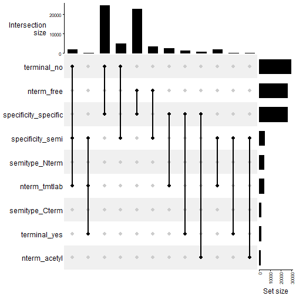

Most identified peptides, as expected, are specific and non-terminal.

In terms of TMT-labelling, we find that most identified peptides don't present a TMT-label at their N-termini. We identify that feature as 'nterm_free' here. This is expected, in the context of our experimental setup, in which TMT labelling was performed before trypsin digestion.

Curiously, we find 2373 peptides that are TMT-labelled at the N-term, but are fully specific. In contrast, 1713 are semi-specific and contain a TMT-tag at the N-term.

We consider the later as peptides that are very likely to exist due to intrinsic proteolytic activity and are the ones that would be used as interesting features for differential abundance analysis of proteolytic products.


```r
check_specif_tmtlab <- filter(nterannot,
                              specificity == "specific",
                              nterm == "TMT-labelled") %>%
                    dplyr::select(-starts_with("wt"),
                                  -starts_with("ko"),
                                  -starts_with("mt"))
```

## Differential abundance analysis

After identifying our set of interesting features, we perform differential abundance analysis using `limma` at the peptide level.

### Prep design matrix

Here we will use the column annotation of our abundance matrix to create our design matrix.


```r
condition <- colnames(pept_matnona) %>%
                    str_sub(start = 1, 
                            end = 2) %>%
                    factor(levels = c("wt", "ko"))

design <- model.matrix(~condition)
```

### Fit limma (Peptide level)

Then we execute `limma` as described in the proteome analysis, but this time based on the peptide abundance matrix.


```r
fit_pept <- lmFit(pept_matnona,
                  design = design,
                  method = 'robust')

fit_pept_eb <- eBayes(fit_pept)

limma_pept_tab <- topTable(fit_pept_eb, 
                      coef = 2, 
                      number = Inf) %>%
                    rownames_to_column("Protein") %>%
                    separate(Protein, 
                             into = c("protein", "peptide"), 
                             remove = FALSE) %>%
  dplyr::rename(index = Protein)
```

### Extract coefficients and feature-specific FDR correction

After fitting the linear model on the whole set of identified and quantified peptides, we want to perform FDR correction only based on a subset of interesting features. In our case, we only want to do FDR correction on the subset of peptides that are semi-specific and contain a TMT-label at the N-term. We consider these peptides as really product of intrinsic proteolysis.

We wrote a function, `feature_specific_fdr` that takes the tabular output from `limma` (the data frame generated as output of the `topTable` function) and a data frame of interesting features to generate a new tabular result from `limma` with feature-specific corrected p-values for each protein.

**Get interesting features**


```r
# merge normalized abundance matrix for tmt-report with peptide annotation
annotated_w_abund <- left_join(pept_abund_mat_nona, 
                               nterannot,
                               by = c("peptide", "protein_id", "gene"))

# select columns with features to evaluate
features <- annotated_w_abund %>%
                    dplyr::select(peptide, index, specificity, nterm, 
                                  semi_type, is_terminal)  

# keep only peptides with interesting features 
interesting_features <- features %>%
                    filter(specificity == "semi_specific",
                           nterm == "TMT-labelled")
```


```r
compar_tab_feat_fdr <- feature_fdr_correction(toptable = limma_pept_tab,
                                              interesting_features_table = interesting_features,
                                              method = "BH")
```

**Evaluate results**


```r
compar_tab_interesting_pept <- compar_tab_feat_fdr %>% 
  dplyr::rename(Protein = protein) %>%
  filter(fdr_correction == 'feature-specific') %>%
  left_join(.,prot2gene)

increased_rec_pept <- compar_tab_interesting_pept %>%
                    filter(logFC > 0,
                           adj.P.Val < 0.05) %>% 
  pull(peptide)

decreased_rec_pept <- compar_tab_interesting_pept %>%
                    filter(logFC < 0,
                           adj.P.Val < 0.05) %>% 
  pull(peptide)
```

226 semi-specific and N-term TMT-labelled peptides are found in increased abundance in the KO group.

640 semi-specific and N-term TMT-labelled peptides are found in decreased abundance in the KO group.

### Volcano plot of peptides


```r
print(pept_semi_plotlim)
```

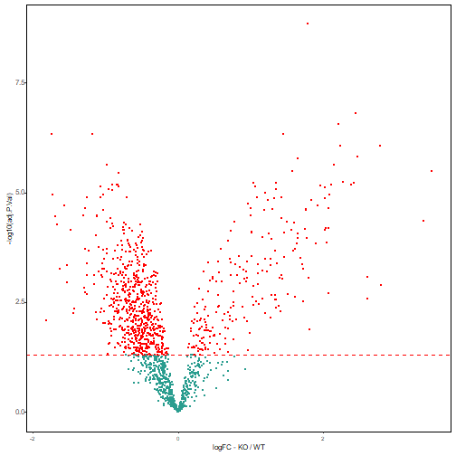


## Proportional abundance of proteolytic peptides

### Prepare data

**Wrangle data**


```r
pept_semi_annot <- nterannot %>%
  dplyr::select(peptide, specificity, is_terminal, nterm) 

pept_quant_to_summary <- quant_annot_pept %>%
  separate(col = index, 
           into = c("protein", "peptide"), 
           sep = "\\_", 
           remove = FALSE) %>%
  left_join(.,pept_semi_annot)

pep_quant_presummary <- pept_quant_to_summary %>%
  dplyr::select(protein, peptide, 
                Abundance, specificity, is_terminal, 
                condition, sample_id, nterm)

pep_quant_presummary_semi <- pep_quant_presummary %>%
  filter(specificity == "semi_specific",
         nterm == "TMT-labelled")
```

**Prepare data with abundance of semi-specific peptides per sample**


```r
pept_summary_int_all <- pep_quant_presummary %>%
  group_by(sample_id, condition) %>%
  summarise(Sum_All = sum(Abundance, na.rm = TRUE))

pept_summary_int_semi <- pep_quant_presummary %>%
  filter(specificity == "semi_specific",
         is_terminal == "not_terminal") %>%
  group_by(sample_id, condition) %>%
  summarise(Sum_Semi = sum(Abundance, na.rm = TRUE))

pept_sum_summary <- left_join(pept_summary_int_all, pept_summary_int_semi) %>%
  mutate(Percentage = Sum_Semi/Sum_All * 100)

# summary of sum of log2 semi-specific peptides per sample

pept_summary_semi_1 <- pep_quant_presummary_semi %>% 
  group_by(sample_id, condition) %>%
  summarise(Sum_All = sum(Abundance, na.rm = TRUE)) %>%
  mutate(`Summed Abundances` = Sum_All)
```

### Generate plot % of abundance of semi-specific peptides


```r
prop_abund_pept <- ggplot(pept_sum_summary, 
                    aes(x = condition, 
                        y = Percentage, fill = condition, 
                        cex.axis = 1.5)) +
  geom_boxplot() +
  geom_jitter(position=position_jitter(0.2)) + 
  # Box plot with jittered points
  # 0.2 : degree of jitter in x direction
  # geom_jitter(shape=16, position=position_jitter(0.2))
  ylab("Proportional intensity of semi-tryptic peptides [%]") +
  geom_signif(
    comparisons = list(c("WT", "KO")),
    map_signif_level = TRUE
  ) + 
  stat_compare_means(method="t.test") +
  theme(axis.text.x = element_text(hjust = 0.5, vjust = 0, size = 6, angle = 360),
        axis.text.y = element_text(hjust = 0.95, vjust = 0.2, size = 8),
        panel.background = element_blank(),
        panel.grid.major = element_blank(),
        panel.border = element_rect(colour = "black", fill=NA, size=0.5),
        axis.title = element_text(size = 8),
        legend.text = element_text(size = 6),
        legend.title = element_text(size = 8),
        legend.key.height= unit(3, 'mm'),
        legend.key.width= unit(3, 'mm'),
        legend.position="bottom") 
```


```r
print(prop_abund_pept)
```

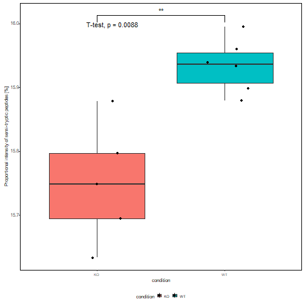

### Generate plot of sum of abundances semi-specific peptides


```r
sum_semi_abunds <- ggplot(pept_summary_semi_1, 
                    aes(x = condition, 
                        y = `Summed Abundances`, fill = condition, 
                        cex.axis = 1.5)) +
  geom_boxplot() +
  #geom_dotplot(binaxis = "y", stackdir = "center", dotsize = 0.5,
  #             ) +
  geom_jitter(position=position_jitter(0.2)) + 
  # Box plot with jittered points
  # 0.2 : degree of jitter in x direction
  # geom_jitter(shape=16, position=position_jitter(0.2))
  ylab("Sum of log2-intensities of semi-tryptic peptides") +
  geom_signif(
    comparisons = list(c("WT", "KO")),
    map_signif_level = TRUE
  ) + 
  stat_compare_means(method="t.test") +
  theme(axis.text.x = element_text(hjust = 0.5, vjust = 0, size = 6, angle = 360),
        axis.text.y = element_text(hjust = 0.95, vjust = 0.2, size = 8),
        panel.background = element_blank(),
        panel.grid.major = element_blank(),
        panel.border = element_rect(colour = "black", fill=NA, size=0.5),
        axis.title = element_text(size = 8),
        legend.text = element_text(size = 6),
        legend.title = element_text(size = 8),
        legend.key.height= unit(3, 'mm'),
        legend.key.width= unit(3, 'mm'),
        legend.position="bottom")
```


```r
print(sum_semi_abunds)
```

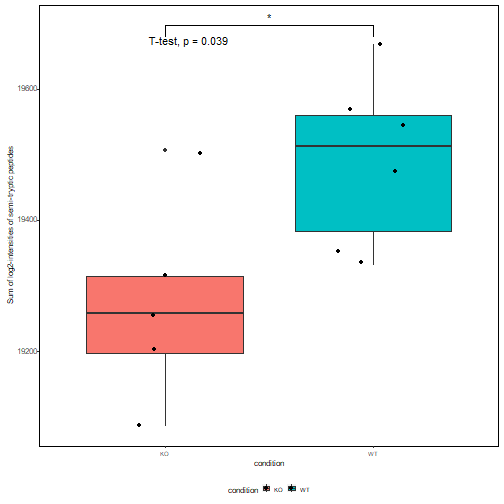

## Comparative analysis of semi-specific peptides vs protein abundance

### Prepare data

#### Get log2FC Summary of abundances of semi-specific peptides


```r
#taking output from limma semi-specific
log2_semi_tryptic <- dplyr::select(compar_tab_interesting_pept,
                                   logFC, Protein, peptide, specificity, 
                                   is_terminal,
                                   Gene) %>%
  filter(specificity == "semi_specific",
         is_terminal == "not_terminal") %>%
  dplyr::rename(logFC_semi_peptide = logFC) %>%
  dplyr::select(-c(specificity, is_terminal))
```

#### Get log2 Summary of protein abundances based only on fully-tryptic peptides


```r
med_prot_quant_specific <- pep_quant_presummary %>%
  group_by(protein, condition) %>%
  summarise(`median(Abundance)` = median(Abundance, na.rm = TRUE)) %>%
  ungroup()
```


```r
# prep wide matrix for median proteins abundances (arousing only from fully-tryptic peptides)
wide_premat_prot_only_tryp <- med_prot_quant_specific %>%
  pivot_wider(id_cols = c("protein"),
              values_from = `median(Abundance)`, 
              names_from = condition) %>%
  dplyr::rename(Protein = protein) %>%
  mutate(logFC_fully_tryp_protein = log2(KO)-log2(WT)) %>%
                    left_join(.,prot2gene)

log2_fully_tryptic <- wide_premat_prot_only_tryp 
```

**Merge log2FCs of semi-tryptic peptides vs proteins with fully tryptic peptides**


```r
log2semipept2_log2protein_spec <- left_join(log2_fully_tryptic, log2_semi_tryptic) %>%
  na.omit() %>%
  mutate(DA_Protein = if_else(Protein %in% tab_sig_prots_tryptic$protein,
                              true = TRUE,
                              false = FALSE),
         DA_peptide = if_else(peptide %in% diff_abund_pept1$peptide,
                              true = TRUE,
                              false = FALSE))
```


```r
check_pept <- cleavage_annoated_peptides %>%
  filter(peptide %in% c(increased_rec_pept, decreased_rec_pept))

inter_scater <- log2semipept2_log2protein_spec %>%
  filter(Protein %in% check_pept$protein_id)

scatter_proteolysis_plot <- ggplot(log2semipept2_log2protein_spec, 
                                   aes(x = logFC_fully_tryp_protein, 
                                       y = logFC_semi_peptide)) + 
  geom_smooth(method=lm, se = FALSE, linetype="dashed", size = 1, 
              color = "black") + 
  geom_point(aes(color = DA_Protein, shape = DA_peptide), size = 1) +
  scale_color_manual(values = c("#2a9d8f", "red")) +
  xlab("log2(FC) - Protein abundances") + 
  ylab("log2(FC) - Semi-specific peptides") + 
  #ggrepel::geom_text_repel(data = inter_scater,
  #                             aes(label = Gene), 
  #                         size = 1,
  #                         box.padding = 0.5,
  #                         max.overlaps = 25) +
  theme(axis.text.x = element_text(hjust = 0.5, vjust = 0, size = 8, angle = 360),
        axis.text.y = element_text(hjust = 0.95, vjust = 0.2, size = 8),
        panel.background = element_blank(),
        panel.grid.major = element_blank(),
        panel.border = element_rect(colour = "black", fill=NA, size=0.5),
        axis.title = element_text(size = 8),
        legend.text = element_text(size = 6),
        legend.title = element_text(size = 8),
        legend.key.height= unit(3, 'mm'),
        legend.key.width= unit(3, 'mm'),
        legend.position="bottom") 

cor.test(log2semipept2_log2protein_spec$logFC_semi_peptide,
    log2semipept2_log2protein_spec$logFC_fully_tryp_protein, method = "pearson")
```

```
## 
## 	Pearson's product-moment correlation
## 
## data:  log2semipept2_log2protein_spec$logFC_semi_peptide and log2semipept2_log2protein_spec$logFC_fully_tryp_protein
## t = 63.588, df = 1426, p-value < 2.2e-16
## alternative hypothesis: true correlation is not equal to 0
## 95 percent confidence interval:
##  0.8456566 0.8727600
## sample estimates:
##       cor 
## 0.8598128
```


```r
print(scatter_proteolysis_plot)
```

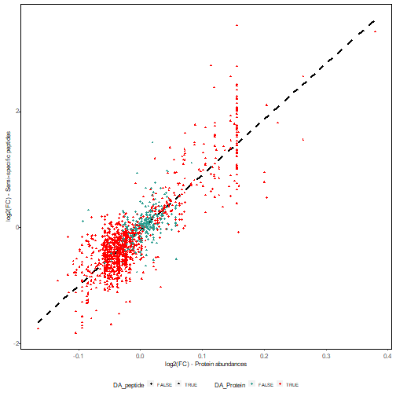


## Analysis of differential amino acid usage (iceLogo)


```r
cleave_areas <- get_cleave_area(cleavage_annoated_peptides)
```


```r
library(dagLogo)
```

**Load background proteome**

Used the identified protein sequences as background proteome.


```r
proteome_ided <- prepareProteome(fasta = here("data-raw/protein.fas"), 
                                 species = "Mus musculus")
```


```r
increased_Rec <- filter(cleave_areas$cleave_area20,
                            Peptide %in% increased_rec_pept)

decreased_Rec <- filter(cleave_areas$cleave_area20,
                            Peptide %in% decreased_rec_pept)

increased_Rec_4ice <- filter(cleave_areas$cleave_area20,
                            Peptide %in% increased_rec_pept) %>%
                    pull(cleave_area20)

decreased_Rec_4ice <- filter(cleave_areas$cleave_area20,
                            Peptide %in% decreased_rec_pept) %>%
                    pull(cleave_area20)
```

**Format peptide sequences**


```r
if(!file.exists(here("report/outputs/formated_pept_daglogo_increased.rds"))){
  
  form_peptidesincreased_4ice <- formatSequence(increased_Rec_4ice, 
                                                proteome = proteome_ided)

  write_rds(form_peptidesincreased_4ice, file = here("report/outputs/formated_pept_daglogo_increased.rds"))
} else {
  
  form_peptidesincreased_4ice <- read_rds(here("report/outputs/formated_pept_daglogo_increased.rds"))
  
}
```


```r
if(!file.exists(here("report/outputs/formated_pept_daglogo_decreased.rds"))){
  
  form_peptidesdecreased_4ice <- formatSequence(decreased_Rec_4ice, 
                                  proteome = proteome_ided)

  write_rds(form_peptidesdecreased_4ice, file = here("report/outputs/formated_pept_daglogo_decreased.rds"))
} else {
  
  form_peptidesdecreased_4ice <- read_rds(here("report/outputs/formated_pept_daglogo_decreased.rds"))
  
}
```

### Differential amino acid usage

#### Increased Proteolityc products


```r
bg_mod_ztest_increased <- buildBackgroundModel(form_peptidesincreased_4ice,
                                           proteome = proteome_ided,
                           background = "wholeProteome",
                           testType = "ztest")
```


```r
dau_nogroup_increased <- testDAU(form_peptidesincreased_4ice, 
                           dagBackground = bg_mod_ztest_increased)
```


```r
dagHeatmap(dau_nogroup_increased) 
```

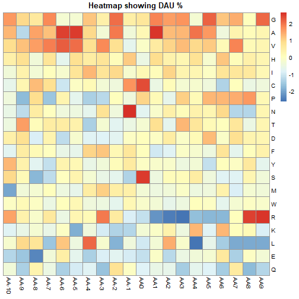


```r
dagLogo(testDAUresults = dau_nogroup_increased, 
        pvalueCutoff = 0.05)
```

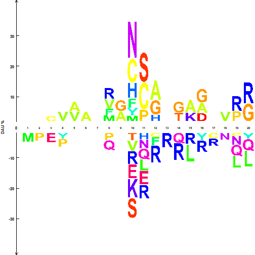

#### Decreased Proteolityc products


```r
bg_mod_ztest_decreased <- buildBackgroundModel(form_peptidesdecreased_4ice,
                                           proteome = proteome_ided,
                           background = "wholeProteome",
                           testType = "ztest")
```


```r
dau_nogroup_decreased <- testDAU(form_peptidesdecreased_4ice, 
                           dagBackground = bg_mod_ztest_decreased)
```


```r
dagHeatmap(dau_nogroup_decreased) 
```


```r
dagLogo(testDAUresults = dau_nogroup_decreased,
        pvalueCutoff = 0.05)
```


## Qualitative information from semi-specific peptides

### Location of (bio)chemical modifications

Another interesting aspect to explore from our peptide identifications after TMT-labelling in the context of a N-terminomics workflow, relates to the (bio)-chemical modifications observed and also the location of these within the protein sequence.

In this workflow, we focus on two modifications: TMT-tag at N-termini, and Acetylation at N-termini.

Based on our experimental context, TMT-tagged peptides at the N-termini can be considered as real proteolytic products while Acetylated N-termini are more likely to represent the mature protein N-termini.

We wrote functions to count the position of these modifications within the protein sequence.


```r
n_counts_comb <- count_location_nterm(nterm_annot = nterannot)
```


```r
print(n_counts_comb$plot_aa_before)
```

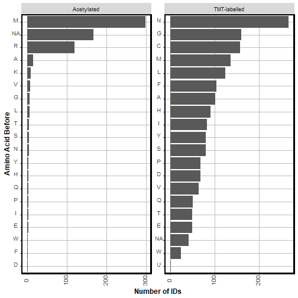


```r
print(n_counts_comb$plot_normalized_location)
```

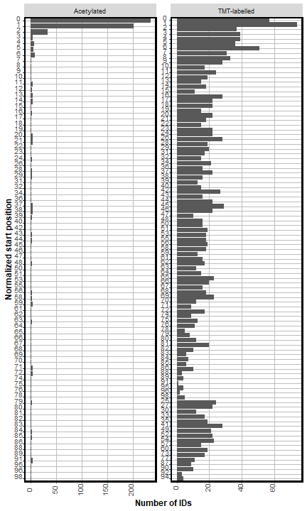

### Annotation of N-terminal peptides as canonical or not

Now we would like to use publicly available data to evaluate the potential origin of the observed N-terminal peptides by comparing their location against annotated processing sites in Uniprot.

For this purpose, we use the `drawProteins` R/Bioconductor package.

In the subsections below, we describe how to extract processing features from Uniprot, and match/compare that information with the location of N-terminal peptides identified in our experiment.

#### Get list of proteins identified with N-terminal peptides


```r
protein_nter <- nterannot %>%
                    dplyr::select(protein_id, peptide, nterm, semi_type, specificity, 
                                  is_terminal, last_aa, aa_before, start_position, end_position) %>%
                    dplyr::filter(str_detect(protein_id, pattern = "Biognosys", negate = TRUE),
                                  specificity == "semi_specific",
                                  nterm %in% c("TMT-labelled", "acetylated"))

protein_ids_nter <- protein_nter$protein_id %>%
                    unique()
```

**Nr of identified proteins with N-term**


```r
length(protein_ids_nter)
```

```
## [1] 691
```

#### Download Uniprot Processing Features

We use the `get_features` function from `drawProteins` in combination with `purrr` to download the annotated features of the interesting proteins using the Uniprot API.


```r
if(!file.exists(here("report/outputs/uniprot_features_pkd.rds"))){
  time1 <- Sys.time()
  uniprot_features <- purrr::map(.x = protein_ids_nter,
                                 .f = drawProteins::get_features)
  time2 <- Sys.time()
  
  write_rds(uniprot_features, 
            file = here("report/outputs/uniprot_features_pkd.rds"))
  
  time_taken <- time2 - time1
  
  write_rds(time_taken, 
            file = here("report/outputs/uniprot_features_pkd_time.rds"))
} else {
  
  uniprot_features <- read_rds(here("report/outputs/uniprot_features_pkd.rds"))
  
  time_taken <- read_rds(here("report/outputs/uniprot_features_pkd_time.rds"))

}
```

**Get features into a data frame format**


```r
df_uniprot_features <- purrr::map(uniprot_features,
                          drawProteins::feature_to_dataframe)

df_features_df <- bind_rows(df_uniprot_features)  
```

#### Match N-term peptides with processing annotation

Then, we want to keep only features associated with post-processing and match the semi-specific cleavage positions vs the end location of the annotated processing sites of the associated protein. Three (+/- 3) amino acid residues were accepted. Then, the matched locations are categorized according to the type of processing associated to it and visualizations are generated.

We bundled this process in the function `categorize_nterm`.


```r
categorized_ntermini <- categorize_nterm(annotated_peptides = nterannot, 
                                         uniprot_features = df_uniprot_features)
```


```r
print(categorized_ntermini$ntermini_category_plot)
```

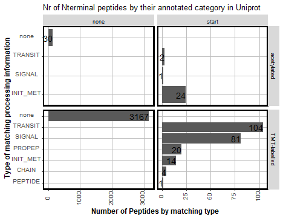
