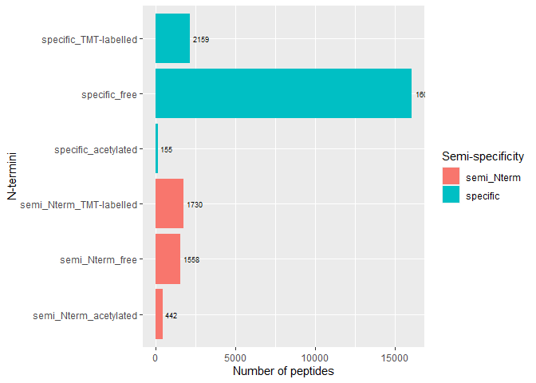

Terminomics analysis of proteolytic processing in polycystic kidney
disease in mice
================
Miguel Cosenza-Contreras and Adrianna Seredynska

- <a
  href="#background-and-general-description-of-the-data-analysis-approach"
  id="toc-background-and-general-description-of-the-data-analysis-approach"><span
  class="toc-section-number">1</span> Background and general description
  of the data analysis approach</a>
- <a href="#general-experimental-information"
  id="toc-general-experimental-information"><span
  class="toc-section-number">2</span> General experimental information</a>
- <a
  href="#short-description-of-database-search-and-quantitation-approach"
  id="toc-short-description-of-database-search-and-quantitation-approach"><span
  class="toc-section-number">3</span> Short description of database search
  and quantitation approach</a>
- <a href="#required-data-and-r-packages"
  id="toc-required-data-and-r-packages"><span
  class="toc-section-number">4</span> Required data and R packages</a>
- <a href="#data-pre-processing" id="toc-data-pre-processing"><span
  class="toc-section-number">5</span> Data pre-processing</a>
  - <a href="#summarization-of-modified-peptides-from-psms"
    id="toc-summarization-of-modified-peptides-from-psms"><span
    class="toc-section-number">5.1</span> Summarization of modified peptides
    from PSMs</a>
  - <a
    href="#correction-for-isobaric-impurity-and-median-centering-the-reporter-ion-intensities"
    id="toc-correction-for-isobaric-impurity-and-median-centering-the-reporter-ion-intensities"><span
    class="toc-section-number">5.2</span> Correction for isobaric impurity
    and median centering the reporter ion intensities</a>
- <a href="#annotation-of-peptide-specificities"
  id="toc-annotation-of-peptide-specificities"><span
  class="toc-section-number">6</span> Annotation of peptide
  specificities</a>
- <a href="#annotate-peptide-n-termini"
  id="toc-annotate-peptide-n-termini"><span
  class="toc-section-number">7</span> Annotate peptide N-termini</a>
- <a
  href="#visualization-of-peptide-counts-by-n-terminal-modification-and-specificity"
  id="toc-visualization-of-peptide-counts-by-n-terminal-modification-and-specificity"><span
  class="toc-section-number">8</span> Visualization of peptide counts by
  N-terminal modification and specificity</a>
- <a
  href="#annotation-of-protein-termini-by-uniprot-annotated-processing-information"
  id="toc-annotation-of-protein-termini-by-uniprot-annotated-processing-information"><span
  class="toc-section-number">9</span> Annotation of protein termini by
  Uniprot-annotated processing information</a>
- <a
  href="#visualization-of-n-termini-counts-by-uniprot-annotated-processing-type"
  id="toc-visualization-of-n-termini-counts-by-uniprot-annotated-processing-type"><span
  class="toc-section-number">10</span> Visualization of N-termini counts
  by Uniprot-annotated processing type</a>
- <a href="#quantitative-analysis-of-semi-specific-peptides"
  id="toc-quantitative-analysis-of-semi-specific-peptides"><span
  class="toc-section-number">11</span> Quantitative analysis of
  Semi-specific peptides</a>
  - <a href="#set-up-the-summarizedexperiment-object"
    id="toc-set-up-the-summarizedexperiment-object"><span
    class="toc-section-number">11.1</span> Set up the
    <code>SummarizedExperiment</code> object</a>
    - <a href="#summarizedexperiment-for-scaled-abundances"
      id="toc-summarizedexperiment-for-scaled-abundances"><span
      class="toc-section-number">11.1.1</span>
      <code>SummarizedExperiment</code> for scaled abundances</a>
    - <a href="#summarizedexperiment-for-unscaled-abundances"
      id="toc-summarizedexperiment-for-unscaled-abundances"><span
      class="toc-section-number">11.1.2</span>
      <code>SummarizedExperiment</code> for unscaled abundances</a>
  - <a
    href="#of-total-summed-abundance-of-semi-specific-peptides-by-the-total-summed-abundance-of-all-peptides-raw-intensities"
    id="toc-of-total-summed-abundance-of-semi-specific-peptides-by-the-total-summed-abundance-of-all-peptides-raw-intensities"><span
    class="toc-section-number">11.2</span> % of total summed abundance of
    semi-specific peptides by the total summed abundance of all peptides
    (raw intensities)</a>
- <a
  href="#differential-abundance-analysis-of-semi-specific-peptides-without-protein-level-normalization"
  id="toc-differential-abundance-analysis-of-semi-specific-peptides-without-protein-level-normalization"><span
  class="toc-section-number">12</span> Differential abundance analysis of
  semi-specific peptides (without protein-level normalization)</a>
  - <a href="#results-of-comparison-and-feature-specific-fdr-correction"
    id="toc-results-of-comparison-and-feature-specific-fdr-correction"><span
    class="toc-section-number">12.1</span> Results of comparison and
    feature-specific FDR correction</a>
- <a
  href="#differential-abundance-analysis-of-semi-specific-peptides-after-protein-level-normalization"
  id="toc-differential-abundance-analysis-of-semi-specific-peptides-after-protein-level-normalization"><span
  class="toc-section-number">13</span> Differential abundance analysis of
  semi-specific peptides (after protein-level normalization)</a>
  - <a href="#results-of-comparison-and-feature-specific-fdr-correction-1"
    id="toc-results-of-comparison-and-feature-specific-fdr-correction-1"><span
    class="toc-section-number">13.1</span> Results of comparison and
    feature-specific FDR correction</a>
- <a href="#visualization-of-differential-abundance-results"
  id="toc-visualization-of-differential-abundance-results"><span
  class="toc-section-number">14</span> Visualization of differential
  abundance results</a>
- <a
  href="#analysis-of-proteolytic-patterns-from-differential-proteolysis"
  id="toc-analysis-of-proteolytic-patterns-from-differential-proteolysis"><span
  class="toc-section-number">15</span> Analysis of proteolytic patterns
  from differential proteolysis</a>

# Background and general description of the data analysis approach

The extraction of information regarding proteolytic processing from
shotgun mass-spectrometry(MS)-based proteomics data realies heavily on
the confident identification of peptides that do not arise from
experimental proteolytic digestion (i.e. tryptic peptides). These
so-called ‘semi-specific’ peptides represent only \~5-15% of the sample,
but allowing their identification by peptide-to-spectrum matching (PSM)
algorithms (i.e. search engines) imposes an increased search space and
therefore a complication in terms of false discovery rate control.

Modern search engines such as MSFragger allow for very fast searches,
which is specially useful when having increased search spaces. In a
similar sense, the use of probabilistic modeling for post-processing and
validating PSMs (i.e., peptideProphet/Percolator) allows for the
reliable identification of an increased number of peptides, even when
faced with increased search spaces.

Based on this observation, we aimed to establish a data analysis
workflow that would allow to exploit these capacities of modern
algorithms for the large-scale identification and quantitation of
products of proteolytic processing from shotgun proteomics data (without
biochemical enrichment) and place this information into biological and
clinical context.

# General experimental information

In order to showcase the capabilities of modern bioformatics tools in
combination with our data analysis approach to extract information
related to proteolytic processing from shotgun proteomics data
(i.e. without biochemical enrichment), we used a mouse model of
polycystic kidney disease (PKD) and isobaric labeling at the protein
level.

In brief, protein was extracted from 11 Formalin-fixed paraffin-embedded
(FFPE) tissue samples and directly labeled before trypsin digestion
using TMT 11plex. Using this approach, we aimed to identify and quantify
both native and neo N-termini; in the later case, assuming that peptides
TMT-labelled at their N-termini would be those coming from intrinsic
proteolytic processing.

# Short description of database search and quantitation approach

We used the FragPipe (v17.1) bioinformatic pipeline for database search,
re-scoring and quantitation.

In brief, we used MSFragger for peptide-to-spectrum matching against
canonical mouse sequences (EBI reference proteomes, version 2021_04). We
used argc semi-specificity (cleavage only at R), based on the assumption
that trypsin would not cleave at K after TMT labeling. Acetylation at
peptide N-term and TMT-labeling at N-term where both set as variable
modifications. TMT at K and carbamidomethylation of C were set as fixed
modifications.

MSBooster was to predict spectra and retention times which were used as
an input for Percolator for probabilistic rescoring and FDR control of
peptide identifications.

The TMT-integrator module was used for extraction and normalization of
quantitative information from MS2 reporter ions.

# Required data and R packages

**Fragterminomics installation and/or loading**

``` r
if (!require("Fragterminomics", quietly = TRUE))
{        
    devtools::install_github("MiguelCos/Fragterminomics")
}

library(Fragterminomics)
```

**Required R packages**

``` r
## Required packages ----
library(tidyverse)
library(kableExtra)
library(limma)
library(clusterProfiler)
library(org.Mm.eg.db)
library(here)
library(janitor)
library(drawProteins)
library(seqinr)
library(ggpubr)
library(ggrepel)
library(DEP)
library(SummarizedExperiment)
library(dagLogo)
library(pheatmap)
```

**Required data**

The main input data for downstream analysis is the `psm.tsv` file
generated by FragPipe. This include peptide modification information
that is used for the identification and categorization of N-termini. For
N-termini mapping and annotation, we use either the fasta file used for
the peptide identification search, or the one containing the identified
proteins, generated by FragPipe (`protein.fas`).

``` r
# loading the psm.tsv file
psm_tsv <- read_tsv(here("data-raw/psm.tsv")) 

fasta <- read.fasta(file = here("data-raw/protein.fas"), 
                    seqtype = "AA", 
                    as.string = TRUE)
```

**Sample annotation data**

We need a file that provides information regarding the sample names, the
TMT channel used for labeling, and the experimental condition. This file
is used for downstream analysis and plotting.

Our starting annotation file is the `annotation.txt` used for the
TMT-integrator module in FragPipe. Here we generate a modified version
of this file, with the information required for downstream analysis. It
is important that the sample label in the annotation file matches the
name of the quantitative columns in the `psm.tsv` file.

``` r
# load data
sample_annotation <- read_delim(here("data-raw/annotation.txt"), 
                                col_names = FALSE)

# genearate condition column
sample_annotation2 <- sample_annotation %>%
                    dplyr::mutate(channel = X1,
                                  condition = str_remove_all(string = `X2`, 
                                                             pattern = "[0-9]"),
                                  label = X2) %>%
                    dplyr::select(-c(X1, 
                                     X2))

sample_annotation3 <- sample_annotation %>%
                    dplyr::rename(channel = X1,
                                  sample = X2) 
```

# Data pre-processing

## Summarization of modified peptides from PSMs

Since we start our analysis based on PSM identifications from the
`psm.tsv` file, we need first to summarize the information at the
modified peptide level.

The summarization of modified peptides from PSMs is based on a ‘best
PSM’ criteria:

- keep only psms with summed TMT intensity \> 0
- keep only psms with peptideProphet prob \> X (user defined)
- keep only psms with purity \> X /\* (user defined)
- if several PSMs map to the same modified peptide, select one with best
  Purity
- if a modified peptide was identified with several PSMs and same high
  purity then select the PSMs with highest summed TMT intensity.

We wrapped a function for this pre-processing step
(`psmtsv_to_modified_peptides`):

``` r
modif_peptides <- psmtsv_to_modified_peptides(psms = psm_tsv, 
                                              annot = sample_annotation3, 
                                              peptide_probability = 0.9,
                                              minimal_purity = 0.5)
```

## Correction for isobaric impurity and median centering the reporter ion intensities

The TMT reporter ion intensities are corrected for isobaric impurity and
median centered. This is done using the `purify_n_normalize` function.

``` r
purified_peptide_data <- purify_n_normalize(psms = modif_peptides,
                                            annot = sample_annotation3)
```

# Annotation of peptide specificities

Based on our generated `modified_peptides` object (summary of modified
peptides from PSMs), we can now annotate the peptide specificities. This
is done using the `annotate_peptides` function.

We need to provide the fasta file used for the peptide identification
search, or the one containing the identified proteins, generated by
FragPipe (`protein.fas`). We have this stored in our `fasta` object.
Currently the function only supports fasta files with Uniprot formatted
headers.

We also need to provide a data frame associating peptides sequences to
Uniprot protein IDs, as defined in the fasta file. The protein ID column
should be named `Genes` and the peptide sequence column should be named
`Peptide`. We can generate such data as follows from the
`modif_peptides` object:

``` r
# select peptide and genes (protein) column for the annotation 
peptide2protein <- modif_peptides %>%
  # generate new Genes column from `Protein ID` one
  mutate(Genes = str_trim(`Protein ID`)) %>%
  dplyr::select(Peptide,
                Genes)
```

Finally, the used should provide the specificity of the protease used
for the digestion. This is done by providing a regular expression that
defines the specificity of the protease. For example, for trypsin, we
would use `R|K` (cleavage after R or K).

``` r
if(!file.exists(here("report/outputs/annotated_best_psm_modified_peptide.tsv"))){
  
  annotated_peptides <- annotate_peptides(peptide2protein = peptide2protein,
                                          fasta = fasta, 
                                          specificity = "R|K",
                                          decoy_tag = "^rev")
  
  write_tsv(x = annotated_peptides,
            file = here("report/outputs/annotated_best_psm_modified_peptide.tsv"))
  
} else {
  
  annotated_peptides <- read_tsv(file = here("report/outputs/annotated_best_psm_modified_peptide.tsv"))
  
}
```

# Annotate peptide N-termini

Starting from the `modified_peptides` object, we first merge with the
specificity annotation table, and then annotation the N-termini based on
the type of modification.

``` r
# merge the modified_peptides table and the annotated peptides table
annotated_best_psms <- left_join(modif_peptides,
                                 annotated_peptides %>%
                                   # remane column to protein_id for merging
                                   dplyr::rename(`Protein ID` = protein_id)) %>%
  clean_names() %>%
  distinct() %>%
  dplyr::select(-c(starts_with("wt"), 
                   starts_with("ko"), 
                   starts_with("mt"))) %>%
  mutate(protein_id_modif_pep = paste(protein_id, 
                                      modified_peptide,
                                      sep = "_")) %>%
  dplyr::relocate("protein_id_modif_pep", 
                  .before = peptide)
```

The `annotate_nterm` function is used to annotate the N-termini based on
the type of modification, currently tailored towards TMT labeling. The
user needs to define the expected tmtmass.

``` r
nterannot <- annotate_nterm(annotated_best_psms,
                            tmtmass = 304.2072) 
```

# Visualization of peptide counts by N-terminal modification and specificity

We first generate counts for each type of N-terminal modification and
specificity. This is done using the `nterannot` object.

``` r
annot_counts <- nterannot %>%
  # count peptides by semi_type and nterm
  dplyr::count(semi_type, 
               nterm) %>%
  # add a column with the total number of peptides
  mutate(total = sum(n)) %>%
  # add a column with the percentage of peptides
  mutate(perc = n/total * 100) %>% 
  # create a category column merging semi_type and nterm
  mutate(category = paste(semi_type, 
                          nterm, 
                          sep = "_")) 
```

… and prepare the data for visualization. In this case, we will focus on
N-terminally truncated peptides for the visualization.

``` r
# new version of the annot_counts - summing semi_Cternm TMT-labelled and semi_Cterm free
annot_counts_v2 <- annot_counts %>%
  mutate(category = case_when(category == "semi_Cterm_free" ~ "semi_Cterm",
                              category == "semi_Cterm_TMT-labelled" ~ "semi_Cterm",
                              TRUE ~ category)) %>%
  filter(!str_detect(semi_type, "semi_Cterm")) %>%
  group_by(category) %>%
  summarise(n = sum(n),
            total = sum(total),
            perc = n/total * 100) %>%
  ungroup() %>%
  mutate(semi_type = case_when(str_detect(category, "semi_Cterm") ~ "semi_Cterm",
                               str_detect(category, "semi_Nterm") ~ "semi_Nterm",
                               TRUE ~ "specific"),
         nterm = case_when(str_detect(category, "TMT") ~ "TMT-labelled",
                           str_detect(category, "acetylated") ~ "acetylated",
                            str_detect(category, "semi_Cterm") ~ "free",
                           TRUE ~ "free"))
```

``` r
ggplot(annot_counts_v2,
       aes(x = n, 
           y = category, 
           fill = semi_type)) +
  geom_col() +
  geom_text(aes(label = n), 
            hjust = -0.2, 
            size = 2.5) +
  labs(y = "N-termini", 
       x = "Number of peptides", 
       fill = "Semi-specificity")
```



# Annotation of protein termini by Uniprot-annotated processing information

After annotating the peptide N-termini, we can annotate the protein
N-termini based on Uniprot-annotated processing information.

We make use of the `drawProteins` package for this, which allows to
extract Uniprot-annotated protein features from the Uniprot database via
API access.

First, we get the list of Uniprot IDs from which we want to extract
processing information from.

``` r
protein_nter <- nterannot %>%
                clean_names() %>%
                    dplyr::select(protein_id, 
                                  peptide, 
                                  semi_type, 
                                  specificity, 
                                  is_terminal, 
                                  last_aa, 
                                  aa_before, 
                                  start_position, 
                                  end_position,
                                  protein_length) %>%
                    dplyr::filter(str_detect(protein_id, 
                                             pattern = "Biognosys", 
                                             negate = TRUE),
                                  specificity == "semi_specific")

protein_ids_nter <- protein_nter$protein_id %>%
                    unique()
```

Then, we extract the Uniprot-annotated processing information for each
protein ID. This is done using the `get_features` function from the
`drawProteins` package.

``` r
if(!file.exists(here("report/outputs/uniprot_features_pkd.rds"))){

  uniprot_features <- purrr::map(.x = protein_ids_nter,
                                 .f = drawProteins::get_features)
  write_rds(uniprot_features, 
            file = here("report/outputs/uniprot_features_pkd.rds"))
  
} else {
  
  uniprot_features <- read_rds(here("report/outputs/uniprot_features_pkd.rds"))

}
```

… and merge the output into a data frame format.

``` r
df_uniprot_features <- purrr::map(uniprot_features,
                                  drawProteins::feature_to_dataframe)

df_features <- bind_rows(df_uniprot_features)  
```

Finally, we annotate the protein N-termini based on the
Uniprot-annotated processing information. This is done using the
`categorize_nterm` function. This will generate a list including tabular
information and a visualization of the counts of N-termini by
Uniprot-annotated processing type and N-terminal modification.

``` r
categorized_termnini <- categorize_nterm(annotated_peptides = nterannot, 
                                         uniprot_features = df_uniprot_features,
                                         distinct = TRUE)
```

``` r
categorize_nterm
```

    function (annotated_peptides, uniprot_features, distinct = TRUE) 
    {
        require(dplyr)
        require(ggplot2)
        protein_semitmt <- annotated_peptides %>% dplyr::select(protein_id, 
            peptide, nterm, semi_type, specificity, is_terminal, 
            last_aa, aa_before, start_position, end_position) %>% 
            dplyr::filter(str_detect(protein_id, pattern = "Biognosys", 
                negate = TRUE), specificity == "semi_specific", nterm %in% 
                c("TMT-labelled"))
        protein_acetyl <- annotated_peptides %>% dplyr::select(protein_id, 
            peptide, nterm, semi_type, specificity, is_terminal, 
            last_aa, aa_before, start_position, end_position) %>% 
            dplyr::filter(str_detect(protein_id, pattern = "Biognosys", 
                negate = TRUE), nterm %in% c("acetylated"))
        protein_nter <- bind_rows(protein_semitmt, protein_acetyl)
        mol_processing_feat <- c("INIT_MET", "PROPEP", "SIGNAL", 
            "TRANSIT")
        upfeat <- bind_rows(uniprot_features)
        df_mol_proc_feat <- upfeat %>% dplyr::filter(type %in% mol_processing_feat, 
            !is.na(length)) %>% dplyr::rename(protein_id = accession)
        nter_pepts_n_feat <- left_join(protein_nter, df_mol_proc_feat, 
            by = "protein_id", relationship = "many-to-many")
        init_match <- nter_pepts_n_feat %>% mutate(matches_start = case_when(semi_type == 
            "semi_Nterm" & abs(as.numeric(start_position) - end) < 
            4 ~ TRUE, semi_type == "semi_Cterm" & abs(as.numeric(end_position) - 
            end) < 4 ~ TRUE, TRUE ~ FALSE)) %>% dplyr::filter(!is.na(matches_start))
        categ_canon_annot <- init_match %>% mutate(match_locat = case_when(matches_start == 
            TRUE ~ "start", matches_start == FALSE ~ "none")) %>% 
            mutate(match_type = case_when(match_locat != "none" & 
                type == "CHAIN" ~ "CHAIN", match_locat != "none" & 
                type == "INIT_MET" ~ "INIT_MET", match_locat != "none" & 
                type == "SIGNAL" ~ "SIGNAL", match_locat != "none" & 
                type == "TRANSIT" ~ "TRANSIT", match_locat != "none" & 
                type == "PROPEP" ~ "PROPEP", match_locat != "none" & 
                type == "PEPTIDE" ~ "PEPTIDE", match_locat == "none" ~ 
                "none"))
        categ2_pept_canannot <- categ_canon_annot %>% dplyr::select(peptide, 
            protein_id, match_locat, match_type, start_position, 
            end_position, begin, end, nterm, specificity, aa_before)
        pept_wmatch <- categ2_pept_canannot %>% dplyr::filter(match_type != 
            "none")
        if (distinct == TRUE) {
            pept_wmatch <- pept_wmatch %>% distinct(peptide, protein_id, 
                match_locat, match_type, .keep_all = TRUE)
        }
        else {
            pept_wmatch <- pept_wmatch
        }
        pept_womatch <- categ2_pept_canannot %>% dplyr::filter(!peptide %in% 
            pept_wmatch$peptide) %>% distinct(peptide, protein_id, 
            match_locat, match_type, .keep_all = TRUE)
        categ2_pept_canannot <- bind_rows(pept_wmatch, pept_womatch) %>% 
            mutate(is_duplicated = duplicated(peptide)) %>% mutate(match_type = case_when(specificity == 
            "specific" ~ "specific_peptide", TRUE ~ match_type), 
            match_locat = case_when(specificity == "specific" ~ "specific_peptide", 
                TRUE ~ match_locat)) %>% mutate(match_type = case_when(match_type == 
            "INIT_MET" & aa_before == "M" & start_position == 2 ~ 
            "INIT_MET", TRUE ~ match_type), )
        count_matches <- categ2_pept_canannot %>% dplyr::count(match_type, 
            nterm)
        nterm_categories_plot <- ggplot(count_matches, aes(x = reorder(match_type, 
            n), y = n)) + coord_flip() + geom_bar(stat = "identity") + 
            geom_text(aes(label = n), hjust = 1, size = 5) + facet_grid(nterm ~ 
            ., scales = "free") + labs(title = "Nr of Nterminal peptides by their annotated category in Uniprot") + 
            labs(y = "Number of Peptides by matching type", x = "Type of matching processing information") + 
            theme(axis.text.x = element_text(hjust = 0.5, vjust = 0.1, 
                size = 10), axis.text.y = element_text(hjust = 0.5, 
                size = 10), panel.background = element_blank(), panel.grid.major = element_line(color = "grey"), 
                panel.border = element_rect(colour = "black", fill = NA, 
                    linewidth = 1.5), axis.title = element_text(size = 12, 
                    face = "bold"))
        nterm_categorization <- list(ntermini_n_processing_features = nter_pepts_n_feat, 
            ntermini_category = categ2_pept_canannot, ntermini_category_counts = count_matches, 
            ntermini_category_plot = nterm_categories_plot)
        return(nterm_categorization)
    }
    <bytecode: 0x0000026ca606b278>
    <environment: namespace:Fragterminomics>

# Visualization of N-termini counts by Uniprot-annotated processing type

``` r
print(categorized_termnini$ntermini_category_plot)
```


# Quantitative analysis of Semi-specific peptides

After annotation, we can use the standardized quantitative information
to evaluate the differential abundance of semi-specific peptides or
proteolytic products between conditions.

## Set up the `SummarizedExperiment` object

For reproducibility and to facilitate downstream analysis, we will use
the `SummarizedExperiment` class to store the quantitative information.
This type of object allows to store column metadata (sample condition
and experimental design) together with row metadata (peptide
annotation).

Our `experimental_design` object contains the sample condition and
experimental design information. This is used to generate the
`SummarizedExperiment` object.

``` r
experimental_design <- sample_annotation2 %>% 
                    filter(condition != "MT") %>%
                    mutate(replicate = channel)
```

### `SummarizedExperiment` for scaled abundances

``` r
# peptide summary 
pure_pet_nona_matrix <- purified_peptide_data$normalized_purif_matrix %>%
                    dplyr::select(-starts_with("MT")) %>%
                    column_to_rownames("protein_peptidemod") %>% 
                    na.omit() %>%
                    as.matrix()


# select modified peptide annotations in the right order from the nterannot object.
annotated_best_psms_nona <- nterannot %>%
                    mutate(protein_id_modif_pep = paste(protein_id, 
                                      modified_peptide,
                                      sep = "_")) %>%
                    filter(protein_id_modif_pep %in% rownames(pure_pet_nona_matrix))

# create summarized experiment object for non-NA peptides (pure_pet_nona_matrix) 
# and non-NA proteins (annotated_best_psms_nona)

data_pept_pur_se_nona <- SummarizedExperiment(
                                              assays = list(counts = pure_pet_nona_matrix),
                                              colData = experimental_design,
                                              rowData = annotated_best_psms_nona
                                              )
```

### `SummarizedExperiment` for unscaled abundances

``` r
# peptide summary 
pure_raw_pet_nona_matrix <- purified_peptide_data$purified_pept_quant %>%
                    dplyr::select(-starts_with("MT")) %>%
                    dplyr::select(-c("Modified Peptide", 
                                          "Peptide",
                                          "Protein ID", 
                                          "Is Unique")) %>%
                    column_to_rownames("protein_id_modif_pep") %>% 
                    na.omit() %>%
                    as.matrix()

annotated_best_psms_raw_pure_nona <- nterannot %>%
                    mutate(protein_id_modif_pep = paste(protein_id, 
                                      modified_peptide,
                                      sep = "_")) %>%
                    filter(protein_id_modif_pep %in% rownames(pure_raw_pet_nona_matrix)) 

# create summarized experiment object 

data_pept_raw_pur_se_nona <- SummarizedExperiment(
                                              assays = list(counts = pure_raw_pet_nona_matrix),
                                              colData = experimental_design,
                                              rowData = annotated_best_psms_raw_pure_nona
                                              )
```

## % of total summed abundance of semi-specific peptides by the total summed abundance of all peptides (raw intensities)

As an exemplary exploratory analysis, we showcase the calculation of the
percentage of total summed abundance of semi-specific peptides by the
total summed abundance of all peptides (raw intensities).

This can be used as a proxy to evaluate the relative abundance of
proteolytic products between experimental conditions.

``` r
# extract peptide level data from summarized experiment object

mat_df_rawpur_nona <- as.data.frame(assay(data_pept_raw_pur_se_nona))

col_dat_df_rawpur_nona <- data.frame(colData(data_pept_raw_pur_se_nona))

row_dat_df_rawpur_nona <- data.frame(rowData(data_pept_raw_pur_se_nona))

# transform into long format

mat_df_rawpur_nona_long <- mat_df_rawpur_nona %>%
  tibble::rownames_to_column("protein_id_modif_pep") %>%
  tidyr::pivot_longer(cols = where(is.numeric), 
                      names_to = "label", 
                      values_to  = "Intensity") %>%
  dplyr::left_join(., col_dat_df_rawpur_nona, 
                   by = "label") %>%
  dplyr::left_join(., row_dat_df_rawpur_nona,
                   by = "protein_id_modif_pep") 

# use the long format data to plot the distribution of normalized abundances
# of proteolytic products

# filter long data to keep only proteolytic products
mat_df_rawpur_nona_long_proteolytic <- mat_df_rawpur_nona_long %>%
  dplyr::filter(specificity == "semi_specific",
                nterm == "TMT-labelled")

pept_summ_rawpur_semi_1 <- mat_df_rawpur_nona_long_proteolytic %>% 
  group_by(label, condition) %>%
  summarise(`Summed Abundances Semis` = sum(Intensity, na.rm = TRUE)) 

# get the summ of all peptides per sample/condition 
pept_summ_rawpur_all <- mat_df_rawpur_nona_long %>% 
  group_by(label, condition) %>%
  summarise(`Summer Abundances Total` = sum(Intensity, na.rm = TRUE)) 

# merge the two data frames to get the normalized abundances of proteolytic products
pept_summ_rawpur_semi_3 <- pept_summ_rawpur_semi_1 %>%
  dplyr::left_join(., pept_summ_rawpur_all, 
                   by = c("label", "condition")) %>%
  mutate(`% of Semi/Total Abundances` = `Summed Abundances Semis`/`Summer Abundances Total` * 100 )
```

``` r
ggplot(pept_summ_rawpur_semi_3, 
        aes(x = condition, 
            y = `% of Semi/Total Abundances`,
            fill = condition)) +
  geom_boxplot() +
  # add jittered dots for data points
  geom_jitter(width = 0.2, 
              height = 0, 
              alpha = 0.5, 
              size = 1) +
  geom_signif(
    comparisons = list(c("WT", "KO")),
    map_signif_level = TRUE
  ) + 
  stat_compare_means(method="wilcox.test") +
  labs(x = "Condition",
       y = "% Protelytic products abundance",
       title = "%Tot. semis/Tot. all") 
```


# Differential abundance analysis of semi-specific peptides (without protein-level normalization)

Now we can move forward with differential abundance analysis, to
pinpoint proteolytic products that are differentially abundant between
experimental conditions.

In first instance, we perform the differential abundance analysis with
standardized abundances ‘as is’, without protein-level normalization.
This means, we compare the abundance of peptides between conditions,
disregarding the abundance of the proteins they belong to. This can be
consired a ‘global’ approach for the differential abundance analysis.
Nevertheless, when using this approach many differentially abundant
proteolytic products would not represent differential proteolysis, but
rather differential protein abundance.

As a proxy to evaluate differential proteolysis, we would need to
perform the differential abundance analysis after correcting peptide
abundances by the abundances of the proteins they belong to. This is
done in the next section.

We use the `limma` package for this purpose. We first generate an
expression matrix and a design matrix including experimental information
for the comparisons, and then run the differential abundance analysis.

After linear model fitting, we apply a feature-specific FDR correction
focusing specifically on interesting features defined as proteolytic
products.

**Prep expression matrix**

``` r
mat <- assay(data_pept_pur_se_nona) %>%
  na.omit()
```

**Set up design matrix**

``` r
# extract the condition from the colData of the summarized experiment object
condition <- colData(data_pept_pur_se_nona)$condition

design <- model.matrix(~ 0 + condition)

rownames(design) <- rownames(colData(data_pept_pur_se_nona))

colnames(design) <- c("KO",
                      "WT")
```

**Run differential abundance analysis**

``` r
fit <- lmFit(object = mat, 
             design = design, 
             method = "robust")
```

``` r
cont.matrix <- makeContrasts(
  KO_vs_WT = KO-WT,
  levels = design)

fit2 <- contrasts.fit(fit, 
                      cont.matrix)

fit2 <- eBayes(fit2)
```

**Generate `topTable` with comparison results**

``` r
KO_vs_WT_peptides_limma <- topTable(fit = fit2, 
                                           coef = "KO_vs_WT",
                                           number = Inf, 
                                           adjust.method = "BH") %>%
  rownames_to_column("protein_id_modif_pep") %>%
  mutate(index = protein_id_modif_pep) %>%
  separate(col = protein_id_modif_pep,
           into = c("protein_id", 
                    "modified_peptide"), 
           sep = "\\_",
           remove = FALSE)
```

## Results of comparison and feature-specific FDR correction

First we need to define which features or modified peptides from our
abundance matrix will be considered as proteolytic products.

We start by excluding non interesting data.

``` r
not_interesting_features <- c("charge", "retention",
                              "observed_mass", "calibrated_observed_mass",
                              "observed_m_z", "calibrated_observed_m_z",
                              "calculated_peptide_mass", "calculated_m_z",
                              "delta_mass", "intensity", "purity")
```

And then define what we consider as proteolytic products based on the
rowData from our `data_pept_pur_se_nona` SummarizedExperiment object.

In this case, we will define as proteolytic products or ‘neo-N-termini’
every semi-specific peptide that was labelled with TMT in the N-termini
(see code below).

``` r
peptide_data_annotation <- as.data.frame(rowData(data_pept_pur_se_nona)) %>%
                    mutate(neo_termini_status = case_when((nterm == "TMT-labelled" & 
                                                           specificity == "semi_specific") ~ "neo_termini",
                                        TRUE ~ "not_neo_termini")) %>%
                    dplyr::select(-all_of(not_interesting_features))
```

Now we can define the interesting features for the feature-specific FDR
correction:

``` r
# select columns with features to evaluate
# from the table mapping modified peptides to annotations 
features <- peptide_data_annotation 

# keep only peptides with interesting features 
interesting_features <- features %>%
  dplyr::rename(index = protein_id_modif_pep) %>%
  filter(neo_termini_status == "neo_termini") %>% 
  distinct()
```

And apply our function `feature_fdr_correction`:

``` r
compar_tab_feat_fdr <- feature_fdr_correction(toptable = KO_vs_WT_peptides_limma,
                                              interesting_features_table = interesting_features,
                                              method = "BH") %>%
  distinct() 
```

We can ‘decorate’ the comparison results with further information about
the outcome of the differential abundance analysis, and merge the
comparison results with the peptide annotation information

``` r
compar_tab_feat_fdr <-  compar_tab_feat_fdr %>%
  left_join(.,peptide_data_annotation) %>%
  mutate(index = protein_id_modif_pep) %>%
  mutate(Feature = if_else(condition = adj.P.Val < 0.05 & fdr_correction == "feature-specific",
                        true = "Differentially abundant",
                        false = "Unchanged")) %>% 
  mutate(Change_direction = case_when((Feature == "Differentially abundant" &
                                        logFC > 0) &
                                        neo_termini_status == "neo_termini" ~ "Up-regulated",
                                      (Feature == "Differentially abundant" &
                                        logFC < 0) &
                                        neo_termini_status == "neo_termini" ~ "Down-regulated",
                                      TRUE ~ "Unchanged/Specific")) %>%
  mutate(Change_direction = factor(Change_direction,
                                   levels = c("Unchanged/Specific",
                                              "Up-regulated",
                                              "Down-regulated")))
```

# Differential abundance analysis of semi-specific peptides (after protein-level normalization)

First we need to normalize the peptide abundances based on the
abundances of the proteins they belong to. This is done using the
`peptide2protein_normalization` function.

This function perform the next processing steps:

- 1.  Get a peptide abundance matrix (raw abundances).

- 2.  Summarize the abundances to protein abundances based on unique
      fully-specific peptides (this is optional but it’s set as such by
      default). This means: we assume that the abundance of a protein is
      represented by the abundance of its unique fully-specific
      peptides.

- 3.  Calculate the peptide to protein ratio.

- 4.  Calculate the fraction of abundance of each peptide which is
      representative of the whole protein abundance.

- 5.  Log2-transform this abundance values and normalize by median
      centering.

``` r
protein_normalized_peptides <- peptide2protein_normalization(peptides = purified_peptide_data$purified_pept_quant,
                                                             annot = sample_annotation3, 
                                                             peptide_annot = annotated_best_psms, 
                                                             summarize_by_specificity = TRUE)
```

**Prep summarizedExperiment object from protein-normalized abundances**

``` r
# peptide summary 
pure_pet_protnorn_matrix <- protein_normalized_peptides$protein_normalized_pepts_scaled %>%
                    dplyr::select(-matches("_MT")) %>%
                    column_to_rownames("protein_id_modif_pep") %>% 
                    na.omit() %>%
                    as.matrix()

# select modified peptide annotations in the right order from the nterannot object.
annotated_best_psms_nona <- nterannot %>%
                    mutate(protein_id_modif_pep = paste(protein_id, 
                                      modified_peptide,
                                      sep = "_")) %>%
                    filter(protein_id_modif_pep %in% rownames(pure_pet_protnorn_matrix))

# create summarized experiment object for non-NA peptides (pure_pet_nona_matrix) 
# and non-NA proteins (annotated_best_psms_nona)

data_pept_protnorn_pur_se_nona <- SummarizedExperiment(
                                              assays = list(counts = pure_pet_protnorn_matrix),
                                              colData = experimental_design,
                                              rowData = annotated_best_psms_nona
                                              )
```

**Prep abundance matrix**

``` r
mat_pept_protnorm <- assay(data_pept_protnorn_pur_se_nona) %>%
  na.omit()
```

**Set up design matrix**

``` r
condition <- colData(data_pept_protnorn_pur_se_nona)$condition

design <- model.matrix(~ 0 + condition)

rownames(design) <- rownames(colData(data_pept_protnorn_pur_se_nona))

colnames(design) <- c("KO",
                      "WT")
```

**Run differential abundance analysis**

``` r
fit_n1 <- lmFit(object = mat_pept_protnorm, 
                design = design, 
                method = "robust")
```

``` r
cont.matrix <- makeContrasts(KO_vs_WT = KO-WT,
                             levels = design)

fit_n2 <- contrasts.fit(fit_n1, 
                        cont.matrix)

fit_n2 <- eBayes(fit_n2)
```

**Generate `topTable` with comparison results**

``` r
KO_vs_WT_pept_protein_normalized_limma <- topTable(fit = fit_n2, 
                                           coef = "KO_vs_WT",
                                           number = Inf, 
                                           adjust.method = "BH") %>%
  rownames_to_column("protein_id_modif_pep") %>%
  mutate(index = protein_id_modif_pep) %>%
  separate(col = protein_id_modif_pep,
           into = c("protein_id", 
                    "modified_peptide"), 
           sep = "\\_",
           remove = FALSE)
```

## Results of comparison and feature-specific FDR correction

**Prepare the data frame of interesting features**

``` r
#n1 refers to protein-normalized peptide intensities
peptide_data_n1_annotation <- as.data.frame(rowData(data_pept_protnorn_pur_se_nona)) %>%
                    mutate(neo_termini_status = case_when((nterm == "TMT-labelled" & 
                                                           specificity == "semi_specific") ~ "neo_termini",
                                        TRUE ~ "not_neo_termini")) %>%
                    dplyr::select(-all_of(not_interesting_features))

# select columns with features to evaluate
# from the table mapping modified peptides to annotations 
features_n1 <- peptide_data_n1_annotation 

# keep only peptides with interesting features 
interesting_features_n1 <- features_n1 %>%
  dplyr::rename(index = protein_id_modif_pep) %>%
  filter(neo_termini_status == "neo_termini") %>% 
  distinct
```

And apply our function `feature_fdr_correction`:

``` r
compar_tab_pept_protein_normalized_feat_fdr <- feature_fdr_correction(toptable = KO_vs_WT_pept_protein_normalized_limma,
                                              interesting_features_table = interesting_features_n1,
                                              method = "BH") %>%
  distinct()
```

… and ‘decorate’ the output limma table

``` r
compar_tab_pept_protein_normalized_feat_fdr <- compar_tab_pept_protein_normalized_feat_fdr %>%
  left_join(.,peptide_data_n1_annotation) %>%
  mutate(index = protein_id_modif_pep) %>%
  mutate(Feature = if_else(condition = adj.P.Val < 0.05 & fdr_correction == "feature-specific",
                        true = "Differentially abundant",
                        false = "Unchanged")) %>% 
  mutate(Change_direction = case_when((Feature == "Differentially abundant" &
                                        logFC > 0) &
                                        neo_termini_status == "neo_termini" ~ "Up-regulated",
                                      (Feature == "Differentially abundant" &
                                        logFC < 0) &
                                        neo_termini_status == "neo_termini" ~ "Down-regulated",
                                      TRUE ~ "Unchanged/Specific")) %>%
  mutate(Change_direction = factor(Change_direction,
                                   levels = c("Unchanged/Specific",
                                              "Up-regulated",
                                              "Down-regulated"))) 
```

# Visualization of differential abundance results

We want now to quickly see the results of the differential abundance
analysis. It is interesting to see how these change between
protein-normalized abundances and non-normalized abundances.

Let’s first prepare the data for visualization.

``` r
# differentially and non-differentially abundant peptides from the non-protein-normalized data
KO_vs_WT_peptides_limma_table_diff_feat_spec_fdr <- compar_tab_feat_fdr %>%
  filter(Change_direction %in% c("Up-regulated",
                                 "Down-regulated"))

KO_vs_WT_peptides_limma_table_nodiff_feat_spec_fdr <- compar_tab_feat_fdr %>%
  filter(!Change_direction %in% c("Up-regulated",
                                 "Down-regulated"))

# differentially and non-differentially abundant peptides from the protein-normalized data
KO_vs_WT_peptides_limma_table_n1_diff_feat_spec_fdr <- compar_tab_pept_protein_normalized_feat_fdr %>%
  filter(Change_direction %in% c("Up-regulated",
                                 "Down-regulated"))

KO_vs_WT_peptides_limma_table_n1_nodiff_feat_spec_fdr <- compar_tab_pept_protein_normalized_feat_fdr %>%
  filter(!Change_direction %in% c("Up-regulated",
                                 "Down-regulated"))
```

… generate the volcano plot objects

``` r
# non-normalized DE results
volcano_limma4 <- ggplot(compar_tab_feat_fdr, 
       aes(x = logFC, 
           y = -log10(adj.P.Val))) +
  geom_point(data = KO_vs_WT_peptides_limma_table_nodiff_feat_spec_fdr,
             color = "grey") +  
  geom_point(data = KO_vs_WT_peptides_limma_table_diff_feat_spec_fdr, 
             color = "red") + 
  geom_hline(yintercept = -log10(0.05),
             color = "red", 
             linetype = "dashed") +
  xlab("logFC(KO / WT)") +
  labs(title = "Diff. abund w/o protein-level normalization\n 
                Feature-specific correction",
       subtitle = paste("Differentially abundant features = ",
                        nrow(KO_vs_WT_peptides_limma_table_diff_feat_spec_fdr))) 

# protein-normalized DE results
volcano_pept_norm_limma3 <- ggplot(compar_tab_pept_protein_normalized_feat_fdr, 
       aes(x = logFC, 
           y = -log10(adj.P.Val))) +
  geom_point(data = KO_vs_WT_peptides_limma_table_n1_nodiff_feat_spec_fdr,
             color = "grey") +  
  geom_point(data = KO_vs_WT_peptides_limma_table_n1_diff_feat_spec_fdr, 
             color = "red") + 
  geom_hline(yintercept = -log10(0.05),
             color = "red", 
             linetype = "dashed") +
  xlab("logFC(KO / WT)") +
  labs(title = "Diff. abund after protein-level normalization\n 
                Feature-specific correction",
       subtitle = paste("Differentially abundant features = ",
                        nrow(KO_vs_WT_peptides_limma_table_n1_diff_feat_spec_fdr))) 
```

Visualize both plots side-by-side:

``` r
cowplot::plot_grid(volcano_limma4,
                   volcano_pept_norm_limma3, 
                   nrow = 1)
```


We can observe that only keep 513 proteolytic products as differentially
abundant after normalization by protein abundance. We consider these as
those representing differential proteolysis.

# Analysis of proteolytic patterns from differential proteolysis

We will now focus on the differentially abundant proteolytic products
after normalization by protein abundance.

For the sake of this demonstrative workflow, we will focus on those
proteolytic products shown as upregulated in the KO condition.

In order to evaluate the sequence patterns at the cleavage sites, we
need to use the sequences of identified truncated peptides or
neo-N-termini, to reconstruct peptide sequences of consistent length,
representing the cleavage site in the central position.

We use the `get_cleave_area` function for this. It takes a peptide
annotation table generated by the `annotate_peptides` function, and
generate a new table with the cleavage area sequences.

We start by pulling out the upregulated proteolytic products from the
limma table.

``` r
upregulated_neo_termini <- KO_vs_WT_peptides_limma_table_n1_diff_feat_spec_fdr %>%
  filter(logFC > 0) %>%
  mutate(Peptide = peptide)
```

We then use the `get_cleave_area` function to generate the cleavage area
sequences.

``` r
cleave_area <- get_cleave_area(upregulated_neo_termini)$cleave_area20
```

Now we have a data frame with the column `cleave_area20`, containing
sequences of 20 amino acid length with the cleavage site between the
10th and 11th amino acid.

We then need to prepare these sequences to be visualized in a heatmap,
counting the number of times each amino acid appears in a given
position.

We start by extracting the sequences of 20 amino acid length from the
`cleave_area` data frame.

``` r
cleave_area_seqs <- cleave_area %>%
                    pull(cleave_area20)
```

And then use the `peptide_matrix_count` function to transform the vector
of sequences into a matrix of counts.

``` r
upregulated_cleavage_area_counts <- peptide_matrix_count(cleave_area_seqs)
```

Finally we can use the `pheatmap` package to generate a heatmap
visualization of amino acid usage at the cleavage site.

``` r
pheatmap(upregulated_cleavage_area_counts$amino_acid_count, 
        cluster_rows = FALSE,
        cluster_cols = FALSE,
        main = "AA Counts - Based on increased proteolytic producs in KO")
```


We see that several of our up-regulated proteolytic products contain C
or S at the P1 position.
